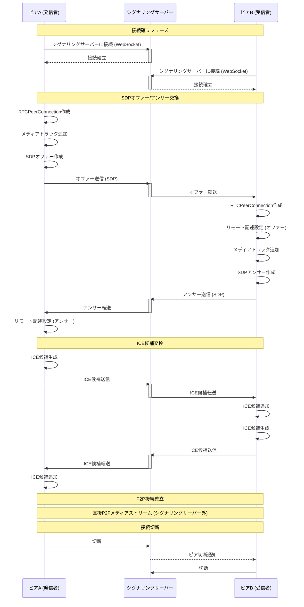
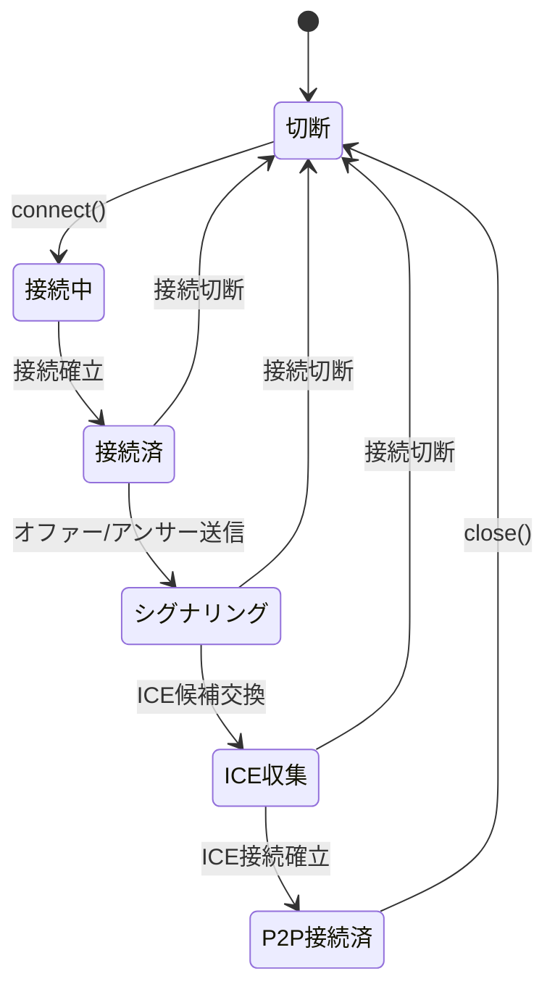

# WebRTCシグナリングサーバーフロー

## 概要

WebRTCは、ピア間の通信を調整しメタデータを交換するためのシグナリングメカニズムが必要です。シグナリングサーバーは、Session Description Protocol (SDP) のオファー/アンサーとICE候補の交換を促進します。

## シグナリングフローダイアグラム



## メッセージタイプ

### 1. 接続管理

- **connect**: シグナリングサーバーへの初期接続
- **disconnect**: クライアントがサーバーから切断
- **peer-connected**: ピアが接続した時の通知
- **peer-disconnected**: ピアが切断した時の通知

### 2. SDP交換

- **offer**: 発信者からのSDPオファーを含む
  - メディア機能を含む
  - コーデック情報
  - トランスポートアドレス

- **answer**: 受信者からのSDPアンサーを含む
  - メディアの受諾/拒否
  - 選択されたコーデック
  - トランスポートアドレス

### 3. ICE候補交換

- **ice-candidate**: ICE候補情報
  - 候補アドレス (IP:Port)
  - プロトコル (UDP/TCP)
  - 優先度
  - 候補タイプ (host/srflx/relay)

### 4. シグナリング状態



## 詳細フロー

### フェーズ1: ピアAがオファーを作成

1. ピアAが`RTCPeerConnection`を作成
2. メディアトラック（音声/動画）を追加
3. `createOffer()`を呼び出し
4. オファーでローカル記述を設定
5. シグナリングサーバーにオファーを送信
6. サーバーがピアBにオファーを転送

### フェーズ2: ピアBがアンサーを作成

1. ピアBがサーバーからオファーを受信
2. `RTCPeerConnection`を作成
3. 受信したオファーでリモート記述を設定
4. メディアトラックを追加
5. `createAnswer()`を呼び出し
6. アンサーでローカル記述を設定
7. シグナリングサーバーにアンサーを送信
8. サーバーがピアAにアンサーを転送

### フェーズ3: ICE候補交換

1. 両ピアがICE候補を生成
2. 各候補がシグナリングサーバーに送信される
3. サーバーが相手ピアに候補を転送
4. ピアが受信した候補を接続に追加
5. ICEフレームワークが接続性をテスト
6. 最適な候補ペアが選択される

### フェーズ4: P2P接続

1. DTLSハンドシェイクが完了
2. SRTPキーが交換される
3. メディアがピア間で直接流れる
4. メディアにはシグナリングサーバーが不要になる

## 実装時の考慮事項

### サーバーサイド

- 各ピアのWebSocket接続を維持
- ピア間でメッセージをルーティング
- ピアの登録/登録解除を処理
- ルーム/セッション管理を実装
- 認証/認可を追加
- レート制限とセキュリティ対策

### クライアントサイド

- サーバーへのWebSocket接続を確立
- 接続状態の変化を処理
- オファー/アンサーの作成を実装
- ICE候補収集を管理
- 接続失敗と再接続を処理
- 切断時の適切なクリーンアップを実装

## セキュリティ考慮事項

1. **認証**: ピアの身元確認
2. **暗号化**: WSS (WebSocket Secure) を使用
3. **DTLS**: セキュアなメディア転送
4. **トークンベースアクセス**: 認可用のセッショントークン
5. **レート制限**: DoS攻撃を防止
6. **入力検証**: すべてのシグナリングメッセージをサニタイズ

## 一般的なシグナリングサーバープロトコル

- WebSocket (最も一般的)
- Socket.IO
- Server-Sent Events (SSE)
- HTTP Long Polling
- カスタムTCP/UDPプロトコル

## メッセージフォーマット例

### オファーメッセージ

```json
{
  "type": "offer",
  "from": "peer-a-id",
  "to": "peer-b-id",
  "sdp": {
    "type": "offer",
    "sdp": "v=0\r\no=- ... (full SDP content)"
  }
}
```

### ICE候補メッセージ

```json
{
  "type": "ice-candidate",
  "from": "peer-a-id",
  "to": "peer-b-id",
  "candidate": {
    "candidate": "candidate:1 1 UDP 2130706431 192.168.1.100 54321 typ host",
    "sdpMid": "0",
    "sdpMLineIndex": 0
  }
}
```

## 参考文献

- [WebRTC Specification](https://www.w3.org/TR/webrtc/)
- [RFC 8831 - WebRTC Data Channels](https://tools.ietf.org/html/rfc8831)
- [RFC 8832 - WebRTC Data Channel Protocol](https://tools.ietf.org/html/rfc8832)
