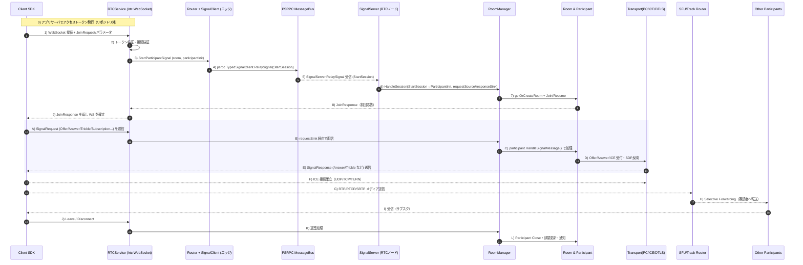

# 通信フロー（シーケンス図と実装箇所）

本ドキュメントは、LiveKit サーバーにおけるクライアント接続〜シグナリング〜WebRTC メディア確立〜配信の一連の通信フローを、シーケンス図と各ステップの実装箇所付きで解説します。対象は本リポジトリ（Go 製 LiveKit サーバー）です。

## シーケンス図

## ステップ解説（実装箇所付き）

- アクセストークン発行（外部）
  - 概要: アプリサーバで JWT（VideoGrant）を発行し、クライアント SDK に渡します。
  - 実装: リポジトリ外（クライアント/アプリ側）。

- /rtc へ WebSocket で接続
  - 概要: クライアントは `/rtc` に接続し、JoinRequest（wrapped 形式またはクエリパラメータ）を送信します。
  - 実装: `pkg/service/rtcservice.go` の `RTCService.ServeHTTP` と `SetupRoutes`（`/rtc` ルート）。

- トークン検証と接続検証
  - 概要: JoinRequest とトークンを検証し、リージョン/ルーム作成可否/制限（Limits）等を確認します。
  - 実装:
    - `pkg/service/rtcservice.go` の `validateInternal`
    - `pkg/service/utils.go` の `ValidateConnectRequest`

- StartParticipantSignal の開始（ルーティング開始）
  - 概要: どのノードで RTC セッションを処理するかを選定し、信号面の接続を開始します。
  - 実装:
    - `pkg/service/rtcservice.go` の `startConnection` → `router.StartParticipantSignal`
    - `pkg/routing/localrouter.go` の `StartParticipantSignal`（単一ノード時）

- psrpc による Signal リレー開通
  - 概要: エッジ側の `SignalClient` が `TypedSignalClient.RelaySignal` ストリームを開き、`StartSession` を送信します。
  - 実装: `pkg/routing/signal.go` の `SignalClient.StartParticipantSignal`

- SignalServer で `RelaySignal` 受信
  - 概要: 対象 RTC ノードの `SignalServer` が `StartSession` を受け取り、ストリームをハイジャックしてリクエスト/レスポンスの message channel を用意します。
  - 実装: `pkg/service/signal.go` の `signalService.RelaySignal`（`Hijack` と `NewSignalMessageSink`/`NewDefaultMessageChannel`）

- HandleSession（セッション開始のハンドオフ）
  - 概要: ノード割当を確認後、`RoomManager.StartSession` に渡します（requestSource/responseSink をセッションに結線）。
  - 実装:
    - `pkg/service/signal.go` の `defaultSessionHandler.HandleSession`
    - `pkg/service/roommanager.go` の `RoomManager.StartSession`

- ルーム生成/参加（Join or Resume）
  - 概要: ルームを作成または取得し、Participant を生成。再接続なら `ResumeParticipant` を実施します。
  - 実装:
    - `pkg/service/roommanager.go` の `getOrCreateRoom`、`Room.Join`/`ResumeParticipant`
    - `pkg/rtc/room.go` の `Join`/`ResumeParticipant`

- JoinResponse 送信（初回応答）
  - 概要: Participant が `JoinResponse` を `responseSink` に書き込みます（他参加者情報や ICE/TURN 情報含む）。
  - 実装:
    - `pkg/rtc/participant_signal.go` の `SendJoinResponse`
    - `pkg/rtc/room.go` の `createJoinResponseLocked`

- WebSocket 確立（初回レスポンスをクライアントへ）
  - 概要: `RTCService` が初回応答を受け取れたら WS をアップグレードし、以後は双方向に転送。
  - 実装:
    - `pkg/service/rtcservice.go` の `readInitialResponse` と `ServeHTTP` 内の転送ループ

- A→E) シグナリング（Offer/Answer/ICE/Subscription 等）
  - 概要: クライアントの `SignalRequest` を `requestSink` 経由で Participant に届け、処理結果を `SignalResponse` で返送します。
  - 実装:
    - WebSocket→Sink 転送: `pkg/service/rtcservice.go`（`ServeHTTP` 内で `cr.RequestSink.WriteMessage`）
    - セッションループ: `pkg/service/roommanager.go` の `rtcSessionWorker`（`requestSource.ReadChan()` から受信）
    - Participant 側ディスパッチ: `pkg/rtc/participant.go` の `HandleSignalMessage` → `pkg/rtc/signalling/signalhandler.go`
    - 応答送信: `pkg/rtc/participant_signal.go`（各 `Signal...` メソッドが `signaller.WriteMessage`）

- D) SDP/ICE/DTLS ハンドシェイク（内部）
  - 概要: Offer/Answer/Trickle を受けて PeerConnection に反映し、ICE/DTLS を確立します。
  - 実装:
    - `pkg/rtc/transportmanager.go` の `HandleOffer/HandleAnswer/HandleICETrickleSDPFragment`
    - `pkg/rtc/transport.go`（ICE/DTLS/データチャネル等の詳細）

- F) ICE 経路確立
  - 概要: UDP 優先（必要に応じて TCP/TLS/TURN フォールバック）。
  - 実装: `pkg/rtc/transport.go`（ICE タイムアウト/キープアライブ/再始動処理など）

- G/H/I) メディア送受信と SFU 転送
  - 概要: Publisher から RTP/RTCP がサーバーへ到達し、SFU が購読者へ選択的転送します。
  - 実装:
    - 受信→配信: `pkg/sfu/*`（`DownTrack`/`UpTrack`、`streamallocator`、`buffer` など）
    - ルーム側の購読制御: `pkg/rtc/room.go` の `subscribeToExistingTracks`、`UpdateSubscriptions`

- J/K/L) 退室/切断
  - 概要: Leave/切断時、Participant をクリーンアップし、ルーム更新や通知を行います。
  - 実装:
    - `pkg/rtc/participant_signal.go` の `sendLeaveRequest`
    - `pkg/rtc/room.go` の `RemoveParticipant`/`CloseIfEmpty`/`Close`
    - `pkg/service/roommanager.go` の `rtcSessionWorker`（切断検知）

## ノード間（分散）観点

- ルーティングと選定
  - `pkg/routing` 一式（`LocalRouter` 単体・`RedisRouter` 分散）。`RoomAllocator`/`selector` でノード選定。
  - Signal は psrpc 経由で対象ノードの `SignalServer` に届けられます。

- Signal リレー（信頼性/再送）
  - `pkg/routing/signal.go` の `signalMessageSink` はバッファ・再送・締切（RetryTimeout）を管理し、信号を安定転送します。

## 参考: 主要ファイル/役割

- HTTP/WS エッジ: `pkg/service/server.go`, `pkg/service/rtcservice.go`
- Signal サーバー: `pkg/service/signal.go`
- ルーティング/psrpc: `pkg/routing/*`
- ルーム/参加者: `pkg/rtc/room.go`, `pkg/rtc/participant.go`
- シグナリング構築: `pkg/rtc/signalling/*`
- WebRTC/PC/ICE: `pkg/rtc/transport*.go`
- SFU/転送: `pkg/sfu/*`

以上。
