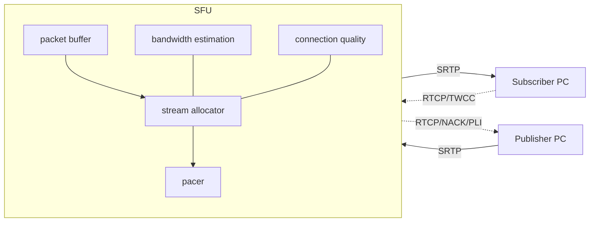

# WebRTC SFU のアーキテクチャと挙動（LiveKit Server）

本ドキュメントでは、LiveKit サーバーにおける WebRTC SFU（Selective Forwarding Unit）の役割、内部構造、主要な処理フロー、輻輳制御・帯域推定、品質・サブスクリプション制御などを、実装ファイルへの参照付きで解説します。

関連: docs/codex/COMMUNICATION_FLOW.md（通信フロー全体）、docs/codex/bandwidth-estimation.md（帯域推定の詳細）

---

## 1. SFU とは（役割と全体像）

- SFU は、各参加者からの RTP メディアを「デコードせずに」中継し、他の参加者へ選択的に転送するコンポーネントです。
- MCU と異なりサーバー側で再エンコードしないため、低遅延・低コストで多人数へスケールします。
- LiveKit では、参加者は Publisher と Subscriber の両面を持ち、SFU は「どの参加者の、どのエンコーディング（レイヤー）を、どの参加者へ転送するか」を動的に決定します。

主要レイヤー（論理）

- シグナリング（制御平面）: 参加/離脱、Offer/Answer、ICE トリクル、サブスクリプション変更等。
- トランスポート（データ平面）: ICE/DTLS/SRTP、RTP/Rtcp、DataChannel。
- SFU コア: トラック/レイヤー管理、フォワーディング、再送、帯域/輻輳制御、品質・購読制御。

---

## 2. 主なコンポーネント（実装ガイド）

- 参加者・ルーム管理
  - `pkg/rtc/room.go`: ルーム内の参加者・トラックの登録、購読制御、イベントブロードキャスト。
  - `pkg/rtc/participant.go`: 参加者のライフサイクル、シグナリング・データ送受、トラック操作。
  - `pkg/rtc/participant_signal.go`: シグナリング応答（Join/Answer/Trickle/更新通知など）の送出。
- トランスポート/WebRTC
  - `pkg/rtc/transport.go`: ICE/DTLS/SRTP、PeerConnection 周辺、DataChannel 設定、RTCP 処理等の中核。
  - `pkg/rtc/transportmanager.go`: Offer/Answer/Trickle の適用、PeerConnection 協調管理、再交渉/ICE 再始動。
- SFU（メディア転送）
  - `pkg/sfu/*`: DownTrack/UpTrack、パケットバッファ、再送、レイヤー選択、Pacer、帯域推定、品質推定など。
  - 代表例:
    - `pkg/sfu/streamallocator/*`: 下りのレート配分・レイヤー選択ロジック。
    - `pkg/sfu/bwe/*`: 帯域推定（Receiver/Send-Side BWE、TWCC 等）。
    - `pkg/sfu/buffer/*`: 受信パケットバッファ、NACK/再送のサポート、拡張ヘッダ解析。
    - `pkg/sfu/pacer/*`: Pace 送信（バースト抑制）。
    - `pkg/sfu/connectionquality/*`: 接続品質推定（レポート生成）。

補助

- シグナリング（制御平面）: `pkg/rtc/signalling/*`（プロト→SignalResponse/Request 変換など）
- ルーティング/分散: `pkg/routing/*`（単一/Redis ベース）、`pkg/service/signal.go`（TypedSignalServer）

---

## 3. メディア転送フロー（Publisher → SFU → Subscribers）

1. Publisher 側の送信

- クライアントは映像/音声を複数レイヤー（Simulcast、SVC）で符号化可能。
- RTP が SFU ノードへ SRTP で到達。

2. 受信・バッファリング・再送制御

- `pkg/sfu/buffer/*` が SSRC ごとにパケットをバッファし、シーケンス/タイムスタンプ管理、欠落検知を行います。
- 欠落時は NACK を発し、再送を受け取り更新。RED（冗長音声）などにも対応（テスト参照: `pkg/sfu/redreceiver_test.go`）。

3. ダウンストリーム選択と Pace 送信

- `streamallocator` が Subscriber のネットワーク状態・購読設定・優先度から「どのレイヤーを転送するか」を決定。
- `pacer` がパケット送信をペース制御し、バーストを回避。

4. 帯域/品質フィードバック

- TWCC/RTCP を用い、`bwe` が利用可能帯域を推定。結果は `streamallocator` に反映。
- 接続品質は `connectionquality` が推定し、クライアントへ通知（`ParticipantImpl.SendConnectionQualityUpdate`）。

---

## 4. 購読/レイヤー制御（Simulcast・SVC・Dynacast/Adaptive Stream）

- サブスクリプション制御
  - 参加者は任意の Track を購読可能。更新はシグナリング経由で `Room.UpdateSubscriptions` に適用されます（`pkg/rtc/room.go`）。
- Simulcast/SVC レイヤー選択
  - Subscriber のウィンドウサイズや帯域に応じて、空間/時間レイヤーを選択。
  - `pkg/sfu/streamallocator` が自動で最適なレイヤーに切り替え。
- Dynacast/Adaptive Stream
  - 使われていないレイヤーは Publisher 側で停止/抑制（無駄なエンコード・送信を削減）。
  - 連携箇所: 参加者の購読状態・視聴要件→`streamallocator`/シグナリング経由で調整。

---

## 5. 輻輳制御・帯域推定（BWE）

- 実装概観
  - TWCC（Transport-Wide CC）による往復到達時間の観測をベースに、送信/受信サイドの BWE 実装を提供（`pkg/sfu/bwe/*`）。
  - `pkg/rtc/transport.go` の interceptor パイプラインにより TWCC などのヘッダ拡張を挿入・観測。
- 主な要素
  - 送信側 BWE: `pkg/sfu/bwe/sendsidebwe`。
  - 受信側 BWE: `pkg/sfu/bwe/remotebwe`。
  - プローブ（容量把握）/制御信号: docs/codex/bandwidth-estimation.md 参照。
- 推定結果の反映
  - 推定容量→`streamallocator` が転送レート/レイヤー切替に反映、`pacer` へ配分。

---

## 6. RTCP 処理・再送・品質向上

- NACK/PLI/FIR
  - 欠落パケットの再送（NACK）、フレーム再送要求（PLI/FIR）に対応。
  - 送信側: RTCP 生成・送出。受信側: バッファから該当パケット再送（`pkg/sfu/buffer`）。
- TWCC レポート
  - 受信サイドで到達タイムスタンプを蓄積し、TWCC レポートとして返却→BWE が解析。
- Connection Quality の算出
  - ロス・遅延・ジッタ等から `connectionquality` がスコア生成、クライアントに通知。

---

## 7. トポロジ（Publisher/Subscriber PeerConnection）

- 二 PC モード（デフォルト）
  - Publisher PC（上り）と Subscriber PC（下り）を分け、安定した転送と再交渉/復旧の独立性を高めます。
- 単一 PC モード
  - 要件に応じて 1 PC に集約可能（`UseSinglePeerConnection`）。`pkg/rtc/participant.go`/`transportmanager.go` で切替。

---

## 8. 再接続/回復・レジューム

- シグナリング再接続
  - `RoomManager.StartSession` が Reconnect をハンドル。`ResumeParticipant` で既存状態を復元（`pkg/rtc/room.go`）。
  - 未整合時は LeaveRequest を返し、フル再接続へ誘導。
- ICE 再始動
  - `HandleICERestartSDPFragment`（`pkg/service/roommanager_service.go`）や `transportmanager.go` で ICE 再始動をサポート。

---

## 9. セキュリティ・ネットワーク周り

- DTLS-SRTP 終端（サーバー側）
  - `pkg/rtc/transport.go` で DTLS ネゴシエーション・鍵合意、SRTP 暗号化/復号を実施。
- TURN/STUN
  - NAT 横断・制限環境へのフォールバック（`pkg/service/server.go` で TURN 構築、ICE 設定は JoinResponse に含む）。
- TCP/TLS フォールバック
  - UDP 不可時の代替経路（`rtc.tcp_port` 設定）。

---

## 10. スケーリングと分散

- 単一ノード
  - `LocalRouter`（`pkg/routing/localrouter.go`）で完結。
- 分散/マルチノード
  - `RedisRouter`（`pkg/routing/redisrouter.go`）が「ルーム→ノード割当」とノードレジストリを管理。
  - psrpc（Redis バス）で Signal を正しいノードへ中継（`pkg/routing/signal.go` と `pkg/service/signal.go`）。

---

## 11. 運用に関わるポイント

- 負荷と品質
  - `config.Room` の `MaxParticipants`、`EnabledCodecs` を適切化。`Limit` でノード上限/メモリ/CPU を管理。
  - 輻輳時の振る舞い（`bandwidth-estimation.md`）を理解し、レイヤー/ビットレート/プローブ閾値を調整。
- 監視
  - Prometheus メトリクス（`pkg/service/server.go`）と各種 `prometheus.*` 計測点。
  - ログで ICE 状態・BWE 変動・サブスク切替・再送/NACK を観察。
- 互換性
  - ブラウザ/SDK により TWCC や Simulcast/SVC サポートが異なるため、`JoinRequest` の設定・クライアント実装を合わせる。

---

## 12. 参考実装ファイル一覧

- ルーム/参加者: `pkg/rtc/room.go`, `pkg/rtc/participant.go`, `pkg/rtc/participant_signal.go`
- トランスポート: `pkg/rtc/transport.go`, `pkg/rtc/transportmanager.go`
- SFU コア: `pkg/sfu/*`（`buffer`, `bwe`, `pacer`, `streamallocator`, `connectionquality` など）
- シグナリング: `pkg/rtc/signalling/*`, `pkg/service/rtcservice.go`, `pkg/service/signal.go`, `pkg/routing/signal.go`
- 分散/ルーティング: `pkg/routing/*`, `pkg/service/roomallocator.go`, `pkg/service/redisstore.go`

---

## 付録: ざっくりデータフロー（簡易図）

上図は実際の詳細を省略した概念図です。詳細な時系列は docs/codex/COMMUNICATION_FLOW.md を参照してください。
