# WebRTC SFU 全体設計書

## 1. 概要

本設計書は、Go言語を用いたWebRTC SFU（Selective Forwarding Unit）の全体設計を定義する。
要件定義書（requirements.md）に基づき、サーバーサイド・クライアントSDK双方のアーキテクチャを網羅する。

## 2. システムアーキテクチャ

### 2.1 全体構成図

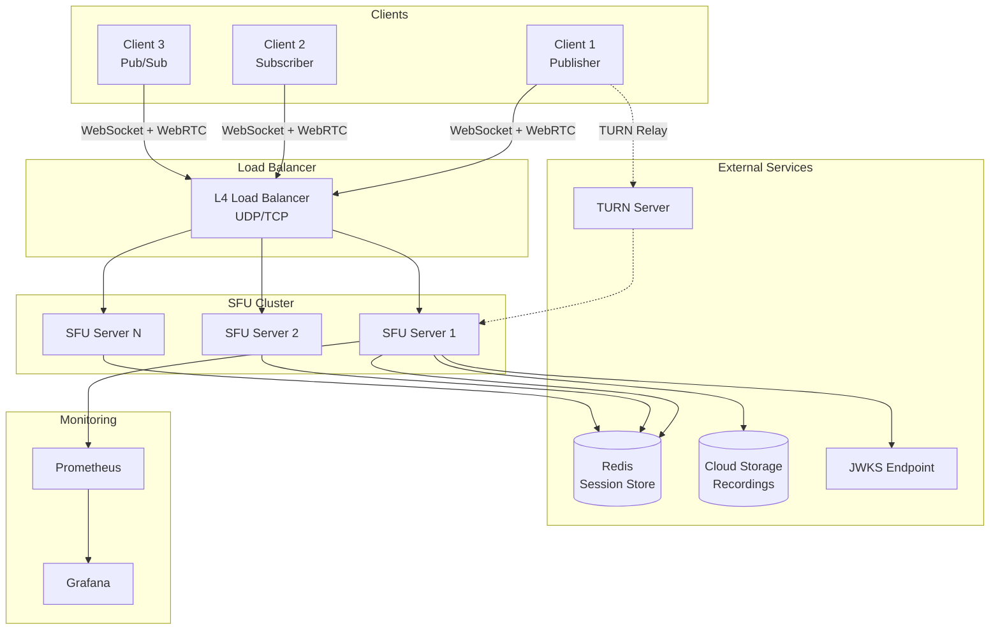

### 2.2 コンポーネント構成

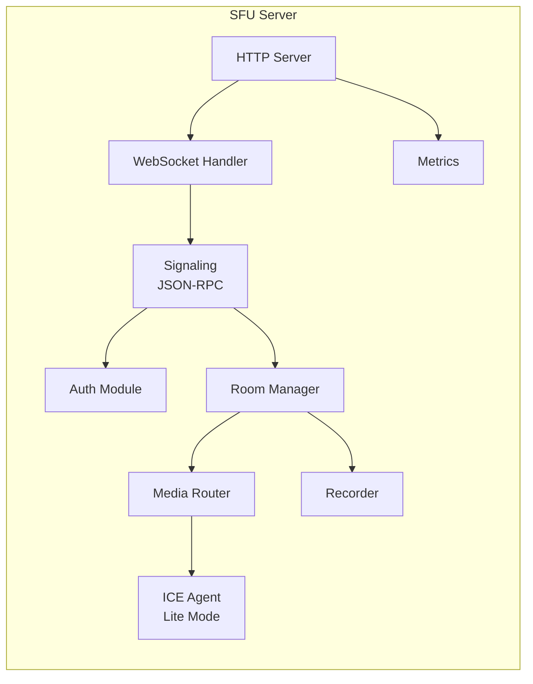

## 3. サーバーサイド設計

### 3.1 レイヤードアーキテクチャ

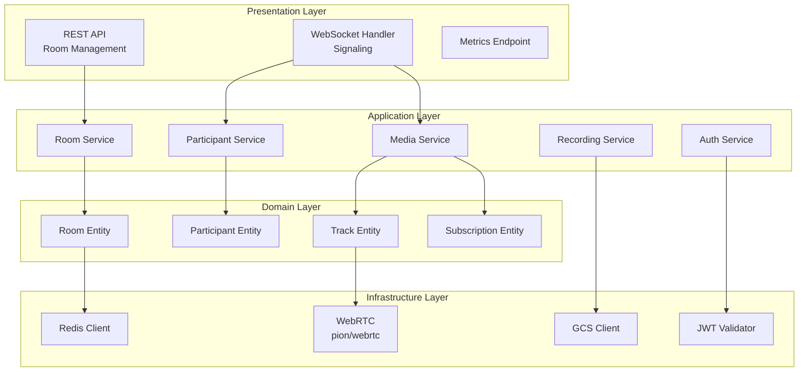

### 3.2 パッケージ構成

```text
sfu/
├── cmd/
│   └── sfu/
│       └── main.go                 # エントリーポイント
├── internal/
│   ├── server/
│   │   ├── server.go               # HTTPサーバー
│   │   ├── routes.go               # ルーティング定義
│   │   └── middleware/
│   │       ├── auth.go             # 認証ミドルウェア
│   │       ├── ratelimit.go        # レート制限
│   │       ├── cors.go             # CORS設定
│   │       └── logging.go          # リクエストログ
│   ├── signaling/
│   │   ├── handler.go              # WebSocketハンドラ
│   │   ├── connection.go           # 接続管理
│   │   ├── protocol/
│   │   │   ├── message.go          # JSON-RPCメッセージ定義
│   │   │   ├── request.go          # リクエスト型
│   │   │   ├── response.go         # レスポンス型
│   │   │   ├── notification.go     # 通知型
│   │   │   └── errors.go           # エラーコード
│   │   └── dispatcher.go           # メッセージディスパッチ
│   ├── room/
│   │   ├── manager.go              # ルームマネージャー
│   │   ├── room.go                 # ルームエンティティ
│   │   ├── participant.go          # 参加者エンティティ
│   │   ├── state.go                # 状態管理
│   │   └── events.go               # ルームイベント
│   ├── media/
│   │   ├── router.go               # メディアルーター
│   │   ├── track.go                # トラック管理
│   │   ├── publisher.go            # パブリッシャー
│   │   ├── subscriber.go           # サブスクライバー
│   │   ├── simulcast/
│   │   │   ├── controller.go       # Simulcast制御
│   │   │   └── layer.go            # レイヤー管理
│   │   └── rtcp/
│   │       ├── handler.go          # RTCPハンドラ
│   │       ├── twcc.go             # TWCC処理
│   │       └── nack.go             # NACK処理
│   ├── webrtc/
│   │   ├── peer.go                 # PeerConnection管理
│   │   ├── sdp.go                  # SDP処理
│   │   ├── ice.go                  # ICE設定
│   │   └── codec.go                # コーデック設定
│   ├── auth/
│   │   ├── jwt.go                  # JWT検証
│   │   ├── jwks.go                 # JWKS取得
│   │   ├── permission.go           # 権限チェック
│   │   └── token.go                # トークン生成
│   ├── recording/
│   │   ├── recorder.go             # 録画制御
│   │   ├── writer.go               # メディア書き込み
│   │   └── storage/
│   │       ├── interface.go        # ストレージIF
│   │       ├── local.go            # ローカル保存
│   │       └── gcs.go              # GCS保存
│   └── store/
│       ├── interface.go            # ストアIF
│       ├── memory.go               # インメモリ（開発用）
│       └── redis.go                # Redis
├── pkg/
│   ├── config/
│   │   └── config.go               # 設定管理
│   ├── logger/
│   │   └── logger.go               # ログ設定
│   └── metrics/
│       └── prometheus.go           # メトリクス定義
├── api/
│   └── openapi.yaml                # OpenAPI仕様
└── configs/
    ├── config.yaml                 # 設定ファイル例
    └── config.production.yaml      # 本番設定例
```

### 3.3 主要インターフェース設計

#### 3.3.1 Room Manager

```go
// RoomManager manages all active rooms
type RoomManager interface {
    // CreateRoom creates a new room with the given configuration
    CreateRoom(ctx context.Context, config RoomConfig) (*Room, error)

    // GetRoom retrieves a room by ID
    GetRoom(ctx context.Context, roomID string) (*Room, error)

    // DeleteRoom removes a room and disconnects all participants
    DeleteRoom(ctx context.Context, roomID string) error

    // ListRooms returns all active rooms
    ListRooms(ctx context.Context) ([]*Room, error)
}

// RoomConfig defines room creation parameters
type RoomConfig struct {
    RoomID          string
    MaxParticipants int
    EmptyTimeout    time.Duration
    Metadata        map[string]interface{}
}
```

#### 3.3.2 Participant

```go
// Participant represents a room participant
type Participant interface {
    // ID returns the participant's unique identifier
    ID() string

    // SessionID returns the session identifier for reconnection
    SessionID() string

    // State returns the current participant state
    State() ParticipantState

    // Publish starts publishing a media track
    Publish(ctx context.Context, kind TrackKind, opts PublishOptions) (*LocalTrack, error)

    // Unpublish stops publishing a track
    Unpublish(ctx context.Context, trackID string) error

    // Subscribe starts receiving a remote track
    Subscribe(ctx context.Context, publisherID, trackID string, opts SubscribeOptions) (*Subscription, error)

    // Unsubscribe stops receiving a track
    Unsubscribe(ctx context.Context, subscriptionID string) error

    // SetPreferredLayer sets the preferred simulcast layer
    SetPreferredLayer(ctx context.Context, trackID string, layer SimulcastLayer) error

    // Close disconnects the participant
    Close() error
}

type ParticipantState string

const (
    ParticipantStateJoining     ParticipantState = "joining"
    ParticipantStateJoined      ParticipantState = "joined"
    ParticipantStatePublishing  ParticipantState = "publishing"
    ParticipantStateSubscribing ParticipantState = "subscribing"
    ParticipantStateLeaving     ParticipantState = "leaving"
    ParticipantStateLeft        ParticipantState = "left"
)
```

#### 3.3.3 Media Router

```go
// MediaRouter handles media stream routing between participants
type MediaRouter interface {
    // AddTrack adds a new published track
    AddTrack(ctx context.Context, track *LocalTrack) error

    // RemoveTrack removes a published track
    RemoveTrack(ctx context.Context, trackID string) error

    // Subscribe creates a subscription to a track
    Subscribe(ctx context.Context, subscriberID, trackID string, opts SubscribeOptions) (*Subscription, error)

    // Unsubscribe removes a subscription
    Unsubscribe(ctx context.Context, subscriptionID string) error

    // GetTrack retrieves track information
    GetTrack(ctx context.Context, trackID string) (*LocalTrack, error)

    // ListTracks lists all tracks in the room
    ListTracks(ctx context.Context) ([]*LocalTrack, error)
}
```

### 3.4 シグナリングフロー

#### 3.4.1 参加フロー

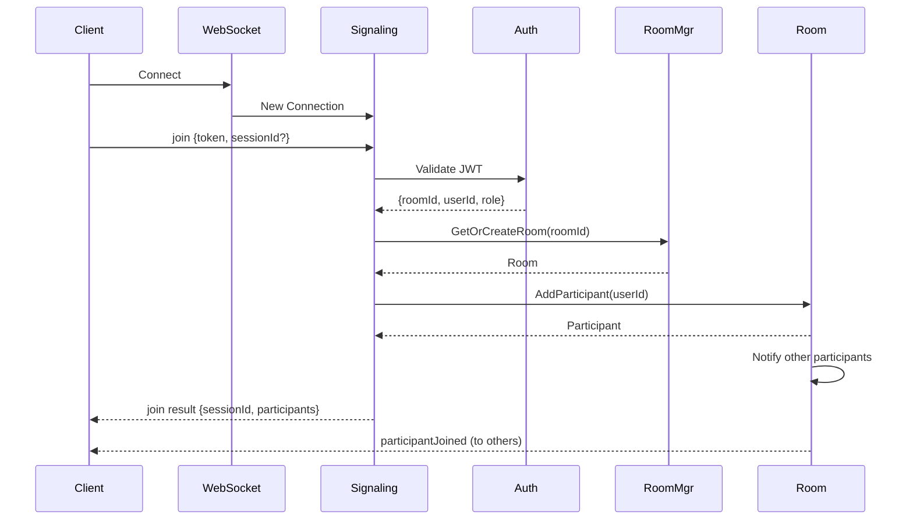

#### 3.4.2 パブリッシュフロー

```mermaid
sequenceDiagram
    participant Client
    participant Signaling
    participant Participant
    participant MediaRouter
    participant Room

    Client->>Signaling: publish {kind, simulcast}
    Signaling->>Participant: Publish(kind, opts)
    Participant->>MediaRouter: AddTrack(track)
    MediaRouter-->>Participant: trackId
    Participant-->>Signaling: LocalTrack
    Signaling-->>Client: publish result {trackId, mid}

    Note over Client,Signaling: SDP Negotiation
    Client->>Signaling: offer {sdp}
    Signaling->>Participant: SetRemoteDescription(offer)
    Participant->>Participant: CreateAnswer()
    Signaling-->>Client: offer result {sdp: answer}

    Client->>Signaling: candidate {candidate}
    Signaling->>Participant: AddICECandidate(candidate)
    Signaling-->>Client: candidate result {}

    Room->>Room: Notify subscribers
    Room-->>Room: trackPublished (to all)
```

#### 3.4.3 サブスクライブフロー

```mermaid
sequenceDiagram
    participant Client
    participant Signaling
    participant Participant
    participant MediaRouter
    participant Publisher

    Client->>Signaling: subscribe {publisherId, trackId}
    Signaling->>Participant: Subscribe(publisherId, trackId)
    Participant->>MediaRouter: Subscribe(trackId)
    MediaRouter->>Publisher: GetTrack(trackId)
    Publisher-->>MediaRouter: RemoteTrack
    MediaRouter->>Participant: AddRemoteTrack(track)

    Note over Participant,Client: Server-initiated SDP Offer
    Participant->>Signaling: Need renegotiation
    Signaling-->>Client: offer notification {sdp, reason}
    Client->>Signaling: answer {sdp}
    Signaling->>Participant: SetRemoteDescription(answer)

    Signaling-->>Client: subscribe result {subscriptionId}
```

#### 3.4.4 サーバー通知スキーマ

要件定義書に基づくJSON-RPC通知スキーマ：

**layerChanged 通知:**

```json
{
  "jsonrpc": "2.0",
  "method": "layerChanged",
  "params": {
    "trackId": "string (トラックID)",
    "requestedLayer": "string (クライアント要求: h|m|l)",
    "actualLayer": "string (実際に選択されたレイヤー: h|m|l)",
    "reason": "string (bandwidth|unavailable)"
  }
}
```

**error 通知:**

```json
{
  "jsonrpc": "2.0",
  "method": "error",
  "params": {
    "code": "number (エラーコード)",
    "message": "string (エラーメッセージ)",
    "fatal": "boolean (接続を切断すべきかどうか)"
  }
}
```

**reconnect 通知:**

```json
{
  "jsonrpc": "2.0",
  "method": "reconnect",
  "params": {
    "reason": "string (ice_disconnected|server_restart)",
    "retryAfterMs": "number (再接続までの待機時間)"
  }
}
```

### 3.5 メディアルーティング設計

#### 3.5.1 トラック管理

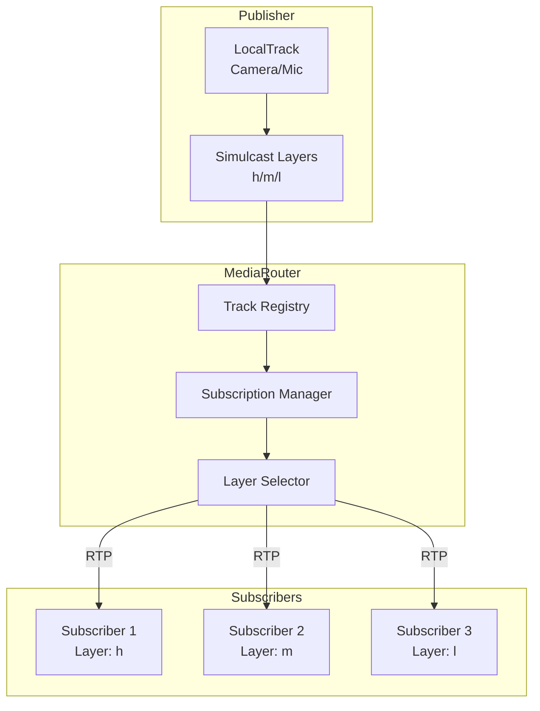

#### 3.5.2 Simulcast制御

```go
// SimulcastController manages layer selection for subscribers
type SimulcastController interface {
    // SetPreferredLayer sets the subscriber's preferred layer
    SetPreferredLayer(subscriptionID string, layer SimulcastLayer) error

    // GetCurrentLayer returns the actual layer being sent
    GetCurrentLayer(subscriptionID string) SimulcastLayer

    // OnBandwidthEstimate handles bandwidth updates
    OnBandwidthEstimate(subscriberID string, bps uint64)

    // OnPacketLoss handles packet loss detection
    OnPacketLoss(subscriberID string, lossRate float64)
}

type SimulcastLayer string

const (
    SimulcastLayerHigh   SimulcastLayer = "h"
    SimulcastLayerMedium SimulcastLayer = "m"
    SimulcastLayerLow    SimulcastLayer = "l"
)

// LayerSpec defines simulcast layer specifications
type LayerSpec struct {
    RID        string
    Width      int
    Height     int
    MaxBitrate int // bps
    MaxFPS     int
}

var DefaultLayers = map[SimulcastLayer]LayerSpec{
    SimulcastLayerHigh:   {RID: "h", Width: 1280, Height: 720, MaxBitrate: 2_500_000, MaxFPS: 30},
    SimulcastLayerMedium: {RID: "m", Width: 640, Height: 360, MaxBitrate: 500_000, MaxFPS: 30},
    SimulcastLayerLow:    {RID: "l", Width: 320, Height: 180, MaxBitrate: 150_000, MaxFPS: 15},
}
```

### 3.6 SDP・相互接続設計

#### 3.6.1 SDP必須要件

| 要件         | 説明                                           |
| ------------ | ---------------------------------------------- |
| Unified Plan | 必須（Plan B非対応）                           |
| BUNDLE       | 必須（全メディアを単一トランスポートで送受信） |
| rtcp-mux     | 必須（RTPとRTCPを同一ポートで送受信）          |

#### 3.6.2 必須RTPヘッダー拡張

| 拡張              | URI                                                                         | 用途                  |
| ----------------- | --------------------------------------------------------------------------- | --------------------- |
| mid               | `urn:ietf:params:rtp-hdrext:sdes:mid`                                       | メディアID識別        |
| rid               | `urn:ietf:params:rtp-hdrext:sdes:rtp-stream-id`                             | Simulcastレイヤー識別 |
| transport-wide-cc | `http://www.ietf.org/id/draft-holmer-rmcat-transport-wide-cc-extensions-01` | 輻輳制御              |
| abs-send-time     | `http://www.webrtc.org/experiments/rtp-hdrext/abs-send-time`                | 送信時刻              |

#### 3.6.3 必須RTCPフィードバック

SDPに以下のrtcp-fb属性を含める：

| フィードバック | 用途                    | 対象       |
| -------------- | ----------------------- | ---------- |
| `nack`         | パケット再送要求        | 映像       |
| `nack pli`     | Picture Loss Indication | 映像       |
| `ccm fir`      | Full Intra Request      | 映像       |
| `goog-remb`    | REMB帯域幅推定          | 映像       |
| `transport-cc` | TWCC輻輳制御            | 映像・音声 |

**SDP例（映像）:**

```text
a=rtcp-fb:96 nack
a=rtcp-fb:96 nack pli
a=rtcp-fb:96 ccm fir
a=rtcp-fb:96 goog-remb
a=rtcp-fb:96 transport-cc
```

#### 3.6.4 コーデックパラメータ

**H.264（両プロファイルを提示してネゴシエーション）:**

| プロファイル                   | profile-level-id | 用途                                 |
| ------------------------------ | ---------------- | ------------------------------------ |
| High Profile Level 5.0         | 640032           | 高品質（1080p30）、デスクトップ向け  |
| Constrained Baseline Level 3.1 | 42e01f           | Safari・モバイル互換、低スペック向け |

共通パラメータ: `packetization-mode=1`, `level-asymmetry-allowed=1`

**SDP例（H.264 High Profile）:**

```text
a=fmtp:96 profile-level-id=640032;packetization-mode=1;level-asymmetry-allowed=1
```

**SDP例（H.264 Constrained Baseline）:**

```text
a=fmtp:97 profile-level-id=42e01f;packetization-mode=1;level-asymmetry-allowed=1
```

**Opus:**

| パラメータ   | 値  | 説明                     |
| ------------ | --- | ------------------------ |
| minptime     | 10  | 最小パケット化時間（ms） |
| useinbandfec | 1   | インバンドFEC有効化      |
| stereo       | 1   | ステレオ対応             |

**SDP例（Opus）:**

```text
a=fmtp:111 minptime=10;useinbandfec=1;stereo=1
```

#### 3.6.5 SDP処理実装

```go
// SDPProcessor handles SDP manipulation
type SDPProcessor interface {
    // ParseOffer parses and validates incoming SDP offer
    ParseOffer(sdp string) (*SessionDescription, error)

    // CreateAnswer generates SDP answer from offer
    CreateAnswer(offer *SessionDescription) (*SessionDescription, error)

    // ApplyCodecPreferences applies codec preferences to SDP
    ApplyCodecPreferences(sd *SessionDescription, prefs CodecPreferences) error

    // NormalizeSafariSDP handles Safari-specific SDP quirks
    NormalizeSafariSDP(sd *SessionDescription) error
}

// CodecPreferences defines codec selection preferences
type CodecPreferences struct {
    VideoCodecs []VideoCodecConfig
    AudioCodecs []AudioCodecConfig
}

type VideoCodecConfig struct {
    Name           string // VP8, H264, VP9, AV1
    Priority       int
    ProfileLevelID string // H.264 only
}

type AudioCodecConfig struct {
    Name      string // opus
    Priority  int
    Channels  int
    ClockRate int
}
```

### 3.7 RTP/RTCP処理設計

#### 3.7.1 RTP処理要件

| 処理                    | 説明                               |
| ----------------------- | ---------------------------------- |
| SSRC管理                | Publisher/Subscriber間のマッピング |
| MID/RID拡張ヘッダー処理 | Simulcastレイヤー識別              |
| シーケンス番号書き換え  | Subscriber向けに正規化             |
| タイムスタンプ正規化    | 連続性の維持                       |
| パケットペーシング      | バースト送信の平滑化               |
| ジッタバッファ          | 50ms（適応的）                     |

```go
// RTPProcessor handles RTP packet processing
type RTPProcessor interface {
    // ProcessIncoming processes incoming RTP packets from publisher
    ProcessIncoming(packet *rtp.Packet) error

    // ForwardToSubscriber forwards RTP to subscriber with necessary transformations
    ForwardToSubscriber(subscriberID string, packet *rtp.Packet) error

    // GetSSRCMapping returns SSRC mapping for a subscriber
    GetSSRCMapping(subscriberID string) map[uint32]uint32
}
```

#### 3.7.2 RTCP処理設計

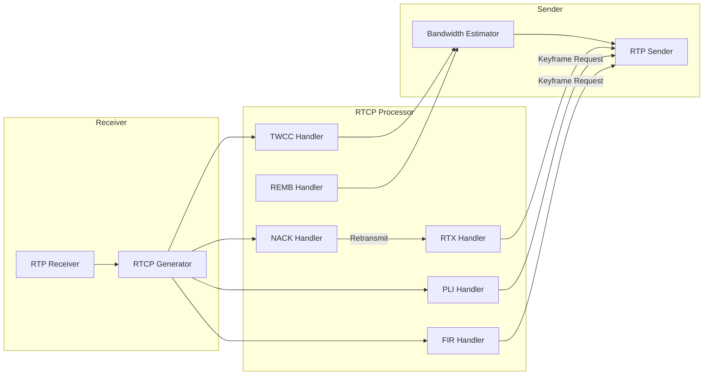

#### 3.7.3 RTCP処理詳細

| RTCP処理             | 要件                         | 説明                                            |
| -------------------- | ---------------------------- | ----------------------------------------------- |
| Receiver Report (RR) | 集約と転送                   | 複数Subscriberからの統計を集約しPublisherへ転送 |
| NACK処理             | パケットロス検出から10ms以内 | 遅延最小化のため高速再送要求                    |
| PLI転送              | 即時                         | Picture Loss Indication をPublisherへ中継       |
| FIR転送              | 即時                         | Full Intra Request をPublisherへ中継            |
| RTX                  | 対応必須                     | 再送専用ストリームの処理                        |

#### 3.7.4 輻輳制御方式

| 受信状況       | SFUの処理                        |
| -------------- | -------------------------------- |
| TWCCのみ受信   | TWCCで帯域幅推定（優先）         |
| REMBのみ受信   | REMBで帯域幅推定（レガシー対応） |
| 両方受信       | TWCCを採用、REMBは無視           |
| どちらも未受信 | デフォルト帯域幅、段階的に下げる |

帯域幅推定の更新間隔: 100ms

#### 3.7.5 品質制御トリガー

| 条件                                 | アクション               |
| ------------------------------------ | ------------------------ |
| パケットロス率 > 5%                  | 低レイヤーへ切り替え     |
| RTT > 300ms                          | 低レイヤーへ切り替え     |
| 帯域幅推定 < 現在のビットレート      | 低レイヤーへ切り替え     |
| パケットロス率 < 1% かつ帯域幅に余裕 | 高レイヤーへ切り替え検討 |

#### 3.7.6 レイヤー制御の優先順位

1. クライアントの`setPreferredLayer`要求を最優先
2. 自動品質制御はクライアント要求の範囲内で動作
3. 要求レイヤーが存在しない場合: 次に近いレイヤーを選択
4. 帯域幅不足の場合: 自動的に低レイヤーへ切り替え、`layerChanged`通知を送信

```go
// LayerController manages simulcast layer selection
type LayerController interface {
    // SetPreferredLayer sets client's preferred layer
    SetPreferredLayer(subscriptionID string, layer SimulcastLayer) error

    // GetActualLayer returns the layer currently being sent
    GetActualLayer(subscriptionID string) SimulcastLayer

    // OnBandwidthChange handles bandwidth estimation changes
    OnBandwidthChange(subscriberID string, bps uint64) LayerChangeResult

    // OnPacketLoss handles packet loss rate changes
    OnPacketLoss(subscriberID string, lossRate float64) LayerChangeResult
}

type LayerChangeResult struct {
    Changed        bool
    PreviousLayer  SimulcastLayer
    CurrentLayer   SimulcastLayer
    Reason         LayerChangeReason
}

type LayerChangeReason string

const (
    LayerChangeReasonBandwidth   LayerChangeReason = "bandwidth"
    LayerChangeReasonUnavailable LayerChangeReason = "unavailable"
)
```

### 3.8 再接続設計

#### 3.8.1 セッション管理

```go
// SessionManager manages participant sessions for reconnection
type SessionManager interface {
    // CreateSession creates a new session for a participant
    CreateSession(participantID string, metadata SessionMetadata) (*Session, error)

    // GetSession retrieves a session by ID
    GetSession(sessionID string) (*Session, error)

    // RefreshSession extends the session timeout
    RefreshSession(sessionID string) error

    // InvalidateSession marks a session as invalid
    InvalidateSession(sessionID string) error

    // RestoreSession restores a participant from a previous session
    RestoreSession(sessionID string, newConn *Connection) (*Participant, error)
}

type Session struct {
    ID            string
    ParticipantID string
    RoomID        string
    CreatedAt     time.Time
    ExpiresAt     time.Time
    State         SessionState
    Metadata      SessionMetadata
    // 復元用の状態
    PublishedTracks  []TrackInfo
    Subscriptions    []SubscriptionInfo
}

type SessionMetadata struct {
    UserAgent    string
    IPAddress    string
    ClientMetadata map[string]interface{}
}
```

#### 3.8.2 再接続フロー

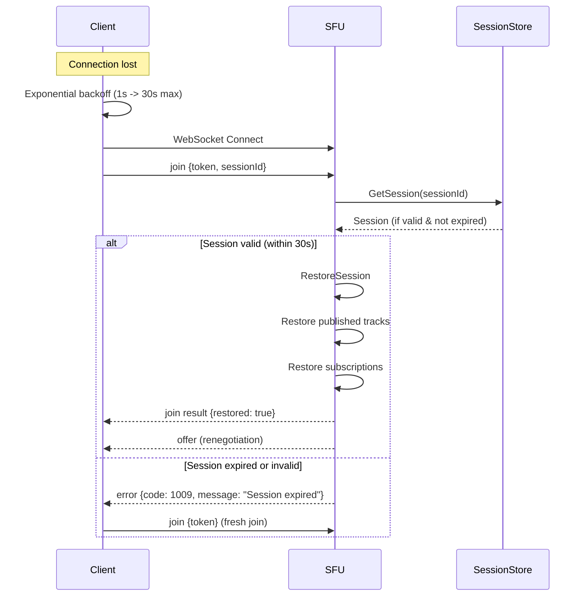

#### 3.8.3 再接続パラメータ

| パラメータ             | 値   | 説明                       |
| ---------------------- | ---- | -------------------------- |
| セッションタイムアウト | 30秒 | 再接続可能な猶予期間       |
| 初期リトライ間隔       | 1秒  | 最初の再接続試行までの待機 |
| 最大リトライ間隔       | 30秒 | 指数バックオフの上限       |
| バックオフ係数         | 2    | 指数バックオフの乗数       |

### 3.9 ICE/NAT越え設計

#### 3.9.1 ICE Lite動作

SFUはICE Liteモードで動作し、以下の前提を満たす必要がある：

| 構成             | 説明                                     | 推奨度 |
| ---------------- | ---------------------------------------- | ------ |
| 公開IPアドレス   | SFUが直接公開IPを持つ                    | 推奨   |
| 1:1 NAT          | 静的NAT変換でSFUポートが外部から到達可能 | 可     |
| ロードバランサー | L4ロードバランサー経由でUDP転送          | 可     |

**ICE Lite制約:**

- SFUはcontrolled role固定
- 候補収集を簡略化（host候補のみ通知）
- srflx/relay候補は生成しない
- クライアント側がフルICEを実行

#### 3.9.2 ICE候補優先順位

クライアントからの候補は以下の優先順位で処理：

| 優先度 | 候補タイプ | 説明                         |
| ------ | ---------- | ---------------------------- |
| 1      | host       | 直接接続（最優先）           |
| 2      | srflx      | STUN経由のNAT越え            |
| 3      | relay      | TURN経由のリレー（最終手段） |

#### 3.9.3 ICE再起動

以下の条件でICE再起動を実行：

| トリガー             | 説明                                 |
| -------------------- | ------------------------------------ |
| ネットワーク切り替え | クライアントのネットワーク変更検出時 |
| ICE接続失敗          | 一定時間接続できない場合             |
| 明示的要求           | クライアントからの再起動要求         |

#### 3.9.4 接続パラメータ

| パラメータ           | 値          | 説明                      |
| -------------------- | ----------- | ------------------------- |
| 接続確立タイムアウト | 30秒        | ICE接続確立の最大待機時間 |
| UDPポート範囲        | 10000-20000 | SFUが使用するUDPポート    |
| IPv4/IPv6方針        | IPv4優先    | IPv6はフォールバック      |

#### 3.9.5 STUN/TURNサーバー

**内蔵STUNサーバー機能:**

SFUは内蔵STUNサーバー機能を提供し、クライアントが外部STUNサーバーなしでNAT越えできる：

| 項目             | 仕様                                 |
| ---------------- | ------------------------------------ |
| 動作モード       | RFC 5389準拠のSTUNサーバー           |
| リスニングポート | シグナリングと同一ポート or 設定可能 |
| 対応リクエスト   | Binding Request                      |
| 認証             | 不要（STUN Binding）                 |

**TURN対応プロトコル:**

| プロトコル | ポート例 | 用途                                |
| ---------- | -------- | ----------------------------------- |
| UDP        | 3478     | 標準TURNポート、最も効率的          |
| TCP        | 3478     | UDP制限環境向け                     |
| TLS        | 443      | 企業ファイアウォール越え、HTTPS偽装 |

```go
// STUNServerConfig defines built-in STUN server configuration
type STUNServerConfig struct {
    // Enable built-in STUN server
    Enabled bool

    // STUN server listening port (default: same as signaling)
    Port uint16
}

// ICEServerConfig defines ICE server configuration
type ICEServerConfig struct {
    // URLs of STUN/TURN servers
    URLs []string

    // Username for TURN authentication
    Username string

    // Credential for TURN authentication
    Credential string

    // CredentialType (password or oauth)
    CredentialType string

    // TURN protocols to use
    TURNProtocols []TURNProtocol
}

type TURNProtocol string

const (
    TURNProtocolUDP TURNProtocol = "udp"
    TURNProtocolTCP TURNProtocol = "tcp"
    TURNProtocolTLS TURNProtocol = "tls"
)

// ICEConfig defines ICE agent configuration
type ICEConfig struct {
    // ICE Lite mode (default: true for SFU)
    Lite bool

    // Built-in STUN server configuration
    STUNServer STUNServerConfig

    // NAT 1:1 mapping IP (if applicable)
    NAT1To1IP string

    // Public IP addresses
    PublicIPs []string

    // UDP port range
    PortRange PortRange

    // Connection timeout
    ConnectionTimeout time.Duration

    // ICE restart timeout
    ICERestartTimeout time.Duration
}

type PortRange struct {
    Min uint16
    Max uint16
}
```

#### 3.9.6 再ネゴシエーショントリガー

以下の条件でSDP再ネゴシエーションを実行：

| トリガー          | offer通知reason     | 説明                                    |
| ----------------- | ------------------- | --------------------------------------- |
| トラック追加      | `track_added`       | 新しいトラックがpublish/subscribeされた |
| トラック削除      | `track_removed`     | トラックがunpublish/unsubscribeされた   |
| Simulcast構成変更 | `simulcast_changed` | Simulcastレイヤー構成が変更された       |
| コーデック変更    | `codec_changed`     | 使用コーデックが変更された              |
| ICE再起動         | `ice_restart`       | ICE接続の再確立が必要                   |

### 3.10 設定スキーマ

```yaml
# config.yaml
server:
  http:
    host: "0.0.0.0"
    port: 8080
    read_timeout: 30s
    write_timeout: 30s
  websocket:
    read_buffer_size: 1024
    write_buffer_size: 1024
    handshake_timeout: 10s
    ping_interval: 30s

webrtc:
  ice_lite: true
  ice_servers:
    - urls:
        - "stun:stun.l.google.com:19302"
    - urls:
        - "turn:turn.example.com:3478"
      username: "" # Generated dynamically
      credential: ""
  port_range:
    min: 10000
    max: 20000
  public_ip: "" # Auto-detect if empty

room:
  max_participants: 100
  empty_timeout: 5m
  max_tracks_per_participant:
    video: 3
    audio: 2
  max_tracks_per_room: 500

media:
  simulcast:
    enabled: true
    layers:
      - rid: "h"
        max_bitrate: 2500000
        max_fps: 30
      - rid: "m"
        max_bitrate: 500000
        max_fps: 30
      - rid: "l"
        max_bitrate: 150000
        max_fps: 15
  codecs:
    video:
      - name: "VP8"
        priority: 1
      - name: "H264"
        priority: 2
        profiles:
          - profile_level_id: "640032" # High Profile Level 5.0
            packetization_mode: 1
            level_asymmetry_allowed: 1
          - profile_level_id: "42e01f" # Constrained Baseline Level 3.1
            packetization_mode: 1
            level_asymmetry_allowed: 1
      - name: "VP9"
        priority: 3
    audio:
      - name: "opus"
        priority: 1
        channels: 2
        clock_rate: 48000
        fmtp:
          minptime: 10
          useinbandfec: 1
          stereo: 1

auth:
  jwt:
    algorithm: "RS256"
    jwks_url: "https://auth.example.com/.well-known/jwks.json"
    issuer: "https://auth.example.com"
    audience: "sfu.example.com"
    cache_ttl: 1h
  rate_limit:
    websocket_connections: 10 # per second per IP
    signaling_messages: 100 # per second per connection
    api_requests: 100 # per minute per token

recording:
  enabled: false
  format: "webm" # webm | mp4
  storage:
    type: "gcs" # gcs (Google Cloud Storage)
    bucket: "recordings"
    project_id: ""
  temp_dir: "/tmp/recordings"
  segment_duration: 1h
  max_segment_size: 1GB
  retention_days: 30

store:
  type: "redis" # memory | redis
  redis:
    address: "localhost:6379"
    password: ""
    db: 0
    pool_size: 10

logging:
  level: "info" # debug | info | warn | error
  format: "json"
  output: "stdout"
  pii_masking: true

metrics:
  enabled: true
  path: "/metrics"
```

## 4. オプション機能設計

### 4.1 機能フラグ一覧

| 機能       | フラグ                    | デフォルト | 説明                   |
| ---------- | ------------------------- | ---------- | ---------------------- |
| Simulcast  | `media.simulcast.enabled` | true       | 複数解像度配信         |
| SVC        | `media.svc.enabled`       | false      | VP9/AV1 SVC対応        |
| 録画       | `recording.enabled`       | false      | メディア録画機能       |
| E2EE       | `security.e2ee.enabled`   | false      | エンドツーエンド暗号化 |
| 分散モード | `cluster.enabled`         | false      | マルチSFU構成          |

### 4.2 録画機能（オプション）

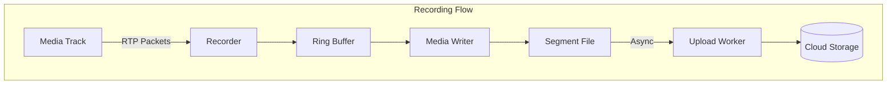

#### 4.2.1 録画API

```go
// RecordingService manages room recording
type RecordingService interface {
    // StartRecording begins recording the specified tracks
    StartRecording(ctx context.Context, roomID string, opts RecordingOptions) (*Recording, error)

    // StopRecording stops an active recording
    StopRecording(ctx context.Context, recordingID string) error

    // GetRecording retrieves recording information
    GetRecording(ctx context.Context, recordingID string) (*Recording, error)

    // ListRecordings lists all recordings for a room
    ListRecordings(ctx context.Context, roomID string) ([]*Recording, error)
}

type RecordingOptions struct {
    TrackIDs    []string           // Empty = all tracks
    Format      RecordingFormat    // webm | mp4
    Participants []string          // Empty = all participants
}

type Recording struct {
    ID          string
    RoomID      string
    Status      RecordingStatus
    StartedAt   time.Time
    StoppedAt   *time.Time
    Duration    time.Duration
    Files       []RecordingFile
    Metadata    RecordingMetadata
}
```

#### 4.2.2 録画の法的要件

```go
// RecordingConsent manages participant recording consent
type RecordingConsent struct {
    ParticipantID string
    Consented     bool
    ConsentedAt   *time.Time
    IPAddress     string  // 同意時のIPアドレス（監査用）
}

// RecordingMetadata stores recording audit information
type RecordingMetadata struct {
    StartedAt       time.Time
    StartedBy       string            // 開始したユーザーID
    Participants    []string          // 録画時の参加者一覧
    ConsentStatus   map[string]bool   // 参加者ごとの同意状況
    NotifiedAt      time.Time         // 参加者への通知日時
}
```

**法的要件チェックリスト:**

| 要件                       | 実装方法                                   |
| -------------------------- | ------------------------------------------ |
| 録画開始時の参加者への通知 | `recordingStarted`通知を全参加者へ送信     |
| 録画同意フラグの管理       | `RecordingConsent`を参加者ごとに保存       |
| 録画メタデータの保存       | 開始時刻、参加者リスト、同意状況をCloud Storageに保存 |

**SDK側イベント:**

- `recordingStarted`: 録画開始を検知しUIで通知表示
- `recordingStopped`: 録画終了を検知

### 4.3 分散モード（将来対応）

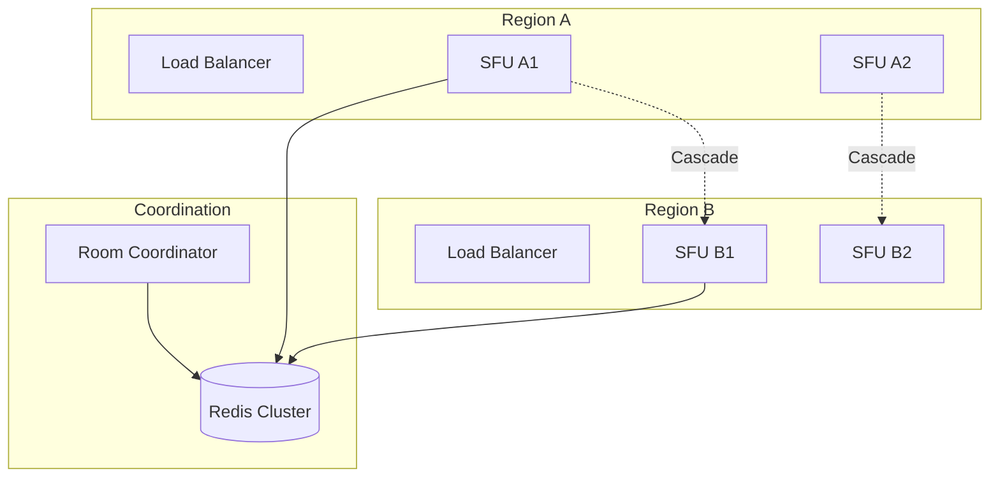

## 5. TypeScript SDK設計

### 5.1 パッケージ構成

```text
@sfu/client-sdk/
├── src/
│   ├── index.ts                    # エントリーポイント
│   ├── client/
│   │   ├── SFUClient.ts            # メインクライアント
│   │   ├── Room.ts                 # ルーム管理
│   │   ├── Participant.ts          # 参加者
│   │   └── Connection.ts           # 接続管理
│   ├── signaling/
│   │   ├── SignalingClient.ts      # WebSocket通信
│   │   ├── JsonRpcClient.ts        # JSON-RPC処理
│   │   └── types.ts                # プロトコル型定義
│   ├── media/
│   │   ├── LocalTrack.ts           # ローカルトラック
│   │   ├── RemoteTrack.ts          # リモートトラック
│   │   ├── MediaDevices.ts         # デバイス管理
│   │   └── Simulcast.ts            # Simulcast制御
│   ├── webrtc/
│   │   ├── PeerConnection.ts       # PC管理
│   │   ├── SDPUtils.ts             # SDP操作
│   │   └── ICEManager.ts           # ICE管理
│   ├── events/
│   │   ├── EventEmitter.ts         # イベント基盤
│   │   └── RoomEvents.ts           # ルームイベント型
│   ├── errors/
│   │   └── SFUError.ts             # エラー定義
│   └── utils/
│       ├── retry.ts                # リトライロジック
│       ├── logger.ts               # ログ出力
│       └── types.ts                # 共通型
├── package.json
├── tsconfig.json
└── README.md
```

### 5.2 クラス図

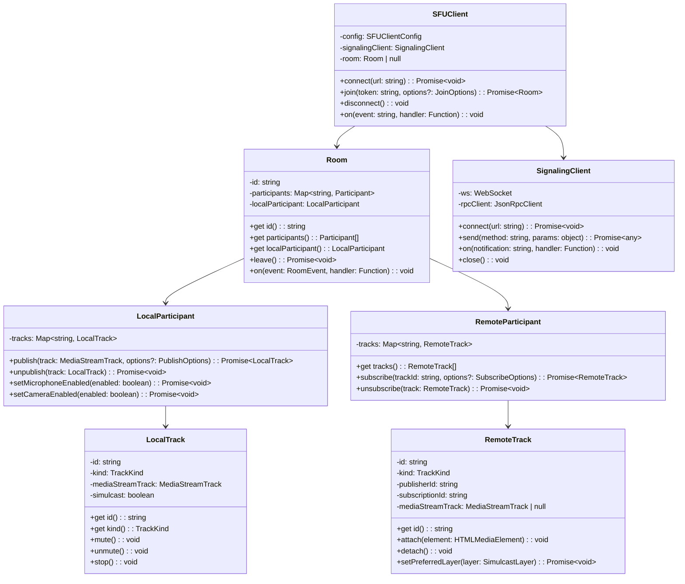

### 5.3 インターフェース定義

```typescript
// ===== Configuration =====

export interface SFUClientConfig {
  /** Signaling server URL (WebSocket) */
  url: string;

  /** Auto-reconnect on disconnect */
  autoReconnect?: boolean;

  /** Reconnect configuration */
  reconnect?: ReconnectConfig;

  /** Logger configuration */
  logger?: LoggerConfig;

  /** ICE server configuration (optional, provided by server) */
  iceServers?: RTCIceServer[];
}

export interface ReconnectConfig {
  /** Maximum retry attempts */
  maxAttempts: number;

  /** Initial retry delay (ms) */
  initialDelay: number;

  /** Maximum retry delay (ms) */
  maxDelay: number;

  /** Delay multiplier for exponential backoff */
  factor: number;
}

export interface JoinOptions {
  /** Reconnection session ID */
  sessionId?: string;

  /** Client metadata */
  metadata?: Record<string, unknown>;

  /** Auto-subscribe to all tracks */
  autoSubscribe?: boolean;
}

// ===== Track Options =====

export interface PublishOptions {
  /** Track name/label */
  name?: string;

  /** Enable simulcast (video only) */
  simulcast?: boolean;

  /** Track metadata */
  metadata?: Record<string, unknown>;

  /** Video encoding settings */
  videoEncoding?: VideoEncodingOptions;

  /** Audio encoding settings */
  audioEncoding?: AudioEncodingOptions;
}

export interface VideoEncodingOptions {
  maxBitrate?: number;
  maxFramerate?: number;
  priority?: "low" | "medium" | "high";
}

export interface AudioEncodingOptions {
  maxBitrate?: number;
  stereo?: boolean;
  dtx?: boolean; // Discontinuous transmission
}

export interface SubscribeOptions {
  /** Preferred simulcast layer */
  preferredLayer?: SimulcastLayer;

  /** Auto-attach to element */
  autoAttach?: HTMLMediaElement;
}

// ===== Types =====

export type TrackKind = "audio" | "video";

export type SimulcastLayer = "h" | "m" | "l";

export type ConnectionState =
  | "disconnected"
  | "connecting"
  | "connected"
  | "reconnecting";

/** Client-side room connection state */
export type RoomState =
  | "disconnected"
  | "connecting"
  | "joined"
  | "reconnecting";

/** Server-side room lifecycle state (received via notifications) */
export type ServerRoomState =
  | "created" // Room created, no participants
  | "active" // 1+ participants present
  | "locked" // New joins prohibited
  | "closing" // Close in progress
  | "closed"; // Room ended

export type ParticipantState =
  | "joining"
  | "joined"
  | "publishing"
  | "subscribing"
  | "leaving"
  | "left";

// ===== Events =====

export interface RoomEvents {
  /** Room state changed */
  stateChanged: (state: RoomState) => void;

  /** New participant joined */
  participantJoined: (participant: RemoteParticipant) => void;

  /** Participant left */
  participantLeft: (
    participant: RemoteParticipant,
    reason: LeaveReason,
  ) => void;

  /** New track published by a participant */
  trackPublished: (track: RemoteTrack, participant: RemoteParticipant) => void;

  /** Track unpublished */
  trackUnpublished: (
    track: RemoteTrack,
    participant: RemoteParticipant,
  ) => void;

  /** Track subscribed (media available) */
  trackSubscribed: (track: RemoteTrack, participant: RemoteParticipant) => void;

  /** Track subscription failed */
  trackSubscriptionFailed: (trackId: string, error: SFUError) => void;

  /** Simulcast layer changed (automatic or user-requested) */
  layerChanged: (event: LayerChangedEvent) => void;

  /** Connection quality changed */
  connectionQualityChanged: (
    quality: ConnectionQuality,
    participant: Participant,
  ) => void;

  /** Reconnecting */
  reconnecting: () => void;

  /** Reconnected successfully */
  reconnected: () => void;

  /** Disconnected */
  disconnected: (reason: DisconnectReason) => void;

  /** Local participant joined (self confirmation) */
  joined: (participantId: string, roomId: string) => void;

  /** Local participant left (self confirmation) */
  left: (reason: LeaveReason) => void;

  /** Server error notification */
  error: (error: ServerError) => void;

  /** Server requested reconnection */
  reconnectRequested: (reason: ReconnectReason, retryAfterMs: number) => void;

  /** Recording started */
  recordingStarted: (recordingId: string, startedBy: string) => void;

  /** Recording stopped */
  recordingStopped: (recordingId: string, stoppedBy: string) => void;
}

/** Simulcast layer change event */
export interface LayerChangedEvent {
  trackId: string;
  requestedLayer: SimulcastLayer;
  actualLayer: SimulcastLayer;
  reason: LayerChangeReason;
}

export type LayerChangeReason = "bandwidth" | "unavailable";

/** Server error notification */
export interface ServerError {
  code: number;
  message: string;
  fatal: boolean; // If true, connection will be closed
}

export type ReconnectReason = "ice_disconnected" | "server_restart";

export type LeaveReason = "leave" | "timeout" | "kicked";

export type DisconnectReason =
  | "client_initiated"
  | "server_shutdown"
  | "room_closed"
  | "kicked"
  | "connection_error";

export type ConnectionQuality = "excellent" | "good" | "fair" | "poor";

// ===== Errors =====

export class SFUError extends Error {
  constructor(
    public code: number,
    message: string,
    public data?: unknown,
  ) {
    super(message);
    this.name = "SFUError";
  }
}

export const ErrorCodes = {
  // JSON-RPC standard errors
  PARSE_ERROR: -32700,
  INVALID_REQUEST: -32600,
  METHOD_NOT_FOUND: -32601,
  INVALID_PARAMS: -32602,
  INTERNAL_ERROR: -32603,

  // Application errors
  ROOM_NOT_FOUND: 1001,
  ROOM_FULL: 1002,
  UNAUTHORIZED: 1003,
  ALREADY_JOINED: 1004,
  NOT_IN_ROOM: 1005,
  TRACK_NOT_FOUND: 1006,
  INVALID_SDP: 1007,
  ICE_FAILURE: 1008,
  SESSION_EXPIRED: 1009,
} as const;
```

### 5.4 使用例

```typescript
import { SFUClient, RoomEvents, SimulcastLayer } from "@sfu/client-sdk";

// Create client
const client = new SFUClient({
  url: "wss://sfu.example.com/ws",
  autoReconnect: true,
  reconnect: {
    maxAttempts: 5,
    initialDelay: 1000,
    maxDelay: 30000,
    factor: 2,
  },
});

// Event handlers
client.on("reconnecting", () => {
  console.log("Connection lost, reconnecting...");
});

client.on("reconnected", () => {
  console.log("Reconnected successfully");
});

// Join room
async function joinRoom(token: string): Promise<void> {
  try {
    const room = await client.join(token, {
      autoSubscribe: true,
      metadata: {
        displayName: "John Doe",
      },
    });

    // Room event handlers
    room.on("participantJoined", (participant) => {
      console.log(`${participant.id} joined the room`);
    });

    room.on("participantLeft", (participant, reason) => {
      console.log(`${participant.id} left: ${reason}`);
    });

    room.on("trackPublished", async (track, participant) => {
      console.log(`${participant.id} published ${track.kind} track`);

      // Subscribe to the track
      const remoteTrack = await participant.subscribe(track.id, {
        preferredLayer: "h",
      });

      // Attach to video element
      const videoElement = document.getElementById(
        "remote-video",
      ) as HTMLVideoElement;
      remoteTrack.attach(videoElement);
    });

    room.on("trackSubscribed", (track, participant) => {
      console.log(`Subscribed to ${track.kind} from ${participant.id}`);
    });

    room.on("connectionQualityChanged", (quality, participant) => {
      console.log(`${participant.id} connection quality: ${quality}`);

      // Adapt layer based on quality
      if (quality === "poor") {
        participant.tracks.forEach((track) => {
          if (track.kind === "video") {
            track.setPreferredLayer("l");
          }
        });
      }
    });

    // Publish local tracks
    const localParticipant = room.localParticipant;

    // Get user media
    const stream = await navigator.mediaDevices.getUserMedia({
      video: { width: 1280, height: 720 },
      audio: true,
    });

    // Publish video with simulcast
    const videoTrack = stream.getVideoTracks()[0];
    await localParticipant.publish(videoTrack, {
      name: "camera",
      simulcast: true,
      metadata: { source: "camera" },
    });

    // Publish audio
    const audioTrack = stream.getAudioTracks()[0];
    await localParticipant.publish(audioTrack, {
      name: "microphone",
      audioEncoding: {
        stereo: false,
        dtx: true,
      },
    });
  } catch (error) {
    if (error instanceof SFUError) {
      console.error(`SFU Error [${error.code}]: ${error.message}`);
    } else {
      throw error;
    }
  }
}

// Screen sharing
async function startScreenShare(room: Room): Promise<void> {
  const stream = await navigator.mediaDevices.getDisplayMedia({
    video: { width: 1920, height: 1080 },
    audio: true, // System audio
  });

  const videoTrack = stream.getVideoTracks()[0];
  await room.localParticipant.publish(videoTrack, {
    name: "screen",
    simulcast: true,
    metadata: { source: "screen" },
  });

  // Handle screen share stop
  videoTrack.onended = async () => {
    await room.localParticipant.unpublish(videoTrack);
  };
}

// Cleanup
async function leaveRoom(room: Room): Promise<void> {
  await room.leave();
  client.disconnect();
}
```

### 5.5 React Hooks（オプション）

```typescript
// @sfu/react-sdk

import { useCallback, useEffect, useState } from "react";
import {
  SFUClient,
  Room,
  LocalParticipant,
  RemoteParticipant,
  LocalTrack,
  RemoteTrack,
  RoomState,
  ConnectionQuality,
} from "@sfu/client-sdk";

// ===== useSFUClient =====

export interface UseSFUClientOptions {
  url: string;
  autoConnect?: boolean;
}

export interface UseSFUClientReturn {
  client: SFUClient | null;
  connectionState: ConnectionState;
  connect: () => Promise<void>;
  disconnect: () => void;
}

export function useSFUClient(options: UseSFUClientOptions): UseSFUClientReturn {
  const [client] = useState(() => new SFUClient({ url: options.url }));
  const [connectionState, setConnectionState] =
    useState<ConnectionState>("disconnected");

  useEffect(() => {
    if (options.autoConnect) {
      client.connect(options.url);
    }

    return () => {
      client.disconnect();
    };
  }, []);

  const connect = useCallback(async () => {
    setConnectionState("connecting");
    await client.connect(options.url);
    setConnectionState("connected");
  }, [client, options.url]);

  const disconnect = useCallback(() => {
    client.disconnect();
    setConnectionState("disconnected");
  }, [client]);

  return { client, connectionState, connect, disconnect };
}

// ===== useRoom =====

export interface UseRoomOptions {
  client: SFUClient;
  token: string;
  autoJoin?: boolean;
}

export interface UseRoomReturn {
  room: Room | null;
  state: RoomState;
  participants: RemoteParticipant[];
  localParticipant: LocalParticipant | null;
  join: () => Promise<void>;
  leave: () => Promise<void>;
}

export function useRoom(options: UseRoomOptions): UseRoomReturn {
  const [room, setRoom] = useState<Room | null>(null);
  const [state, setState] = useState<RoomState>("disconnected");
  const [participants, setParticipants] = useState<RemoteParticipant[]>([]);

  useEffect(() => {
    if (!room) return;

    const handleStateChange = (newState: RoomState) => setState(newState);
    const handleParticipantJoined = (p: RemoteParticipant) => {
      setParticipants((prev) => [...prev, p]);
    };
    const handleParticipantLeft = (p: RemoteParticipant) => {
      setParticipants((prev) => prev.filter((x) => x.id !== p.id));
    };

    room.on("stateChanged", handleStateChange);
    room.on("participantJoined", handleParticipantJoined);
    room.on("participantLeft", handleParticipantLeft);

    return () => {
      room.off("stateChanged", handleStateChange);
      room.off("participantJoined", handleParticipantJoined);
      room.off("participantLeft", handleParticipantLeft);
    };
  }, [room]);

  const join = useCallback(async () => {
    const r = await options.client.join(options.token);
    setRoom(r);
    setParticipants([...r.participants]);
  }, [options.client, options.token]);

  const leave = useCallback(async () => {
    if (room) {
      await room.leave();
      setRoom(null);
      setParticipants([]);
    }
  }, [room]);

  useEffect(() => {
    if (options.autoJoin) {
      join();
    }
  }, []);

  return {
    room,
    state,
    participants,
    localParticipant: room?.localParticipant ?? null,
    join,
    leave,
  };
}

// ===== useLocalMedia =====

export interface UseLocalMediaOptions {
  video?: boolean | MediaTrackConstraints;
  audio?: boolean | MediaTrackConstraints;
}

export interface UseLocalMediaReturn {
  stream: MediaStream | null;
  videoTrack: MediaStreamTrack | null;
  audioTrack: MediaStreamTrack | null;
  isLoading: boolean;
  error: Error | null;
  getMedia: () => Promise<void>;
  stopMedia: () => void;
}

export function useLocalMedia(
  options: UseLocalMediaOptions = {},
): UseLocalMediaReturn {
  const [stream, setStream] = useState<MediaStream | null>(null);
  const [isLoading, setIsLoading] = useState(false);
  const [error, setError] = useState<Error | null>(null);

  const getMedia = useCallback(async () => {
    setIsLoading(true);
    setError(null);
    try {
      const s = await navigator.mediaDevices.getUserMedia({
        video: options.video ?? true,
        audio: options.audio ?? true,
      });
      setStream(s);
    } catch (e) {
      setError(e as Error);
    } finally {
      setIsLoading(false);
    }
  }, [options.video, options.audio]);

  const stopMedia = useCallback(() => {
    if (stream) {
      stream.getTracks().forEach((t) => t.stop());
      setStream(null);
    }
  }, [stream]);

  useEffect(() => {
    return () => {
      stopMedia();
    };
  }, []);

  return {
    stream,
    videoTrack: stream?.getVideoTracks()[0] ?? null,
    audioTrack: stream?.getAudioTracks()[0] ?? null,
    isLoading,
    error,
    getMedia,
    stopMedia,
  };
}

// ===== useRemoteTrack =====

export interface UseRemoteTrackOptions {
  track: RemoteTrack;
  preferredLayer?: SimulcastLayer;
}

export interface UseRemoteTrackReturn {
  mediaRef: React.RefObject<HTMLVideoElement | HTMLAudioElement>;
  isSubscribed: boolean;
  currentLayer: SimulcastLayer | null;
  setPreferredLayer: (layer: SimulcastLayer) => Promise<void>;
}

export function useRemoteTrack(
  options: UseRemoteTrackOptions,
): UseRemoteTrackReturn {
  const mediaRef = useRef<HTMLVideoElement | HTMLAudioElement>(null);
  const [isSubscribed, setIsSubscribed] = useState(false);
  const [currentLayer, setCurrentLayer] = useState<SimulcastLayer | null>(null);

  useEffect(() => {
    const el = mediaRef.current;
    if (el && options.track) {
      options.track.attach(el);
      setIsSubscribed(true);
    }

    return () => {
      if (options.track) {
        options.track.detach();
      }
    };
  }, [options.track]);

  const setPreferredLayer = useCallback(
    async (layer: SimulcastLayer) => {
      await options.track.setPreferredLayer(layer);
      setCurrentLayer(layer);
    },
    [options.track],
  );

  return {
    mediaRef,
    isSubscribed,
    currentLayer,
    setPreferredLayer,
  };
}
```

### 5.6 React使用例

```tsx
import React, { useEffect } from "react";
import {
  useSFUClient,
  useRoom,
  useLocalMedia,
  useRemoteTrack,
} from "@sfu/react-sdk";

function VideoRoom({ token }: { token: string }) {
  const { client, connect, connectionState } = useSFUClient({
    url: "wss://sfu.example.com/ws",
    autoConnect: true,
  });

  const { room, participants, localParticipant, join, leave } = useRoom({
    client: client!,
    token,
    autoJoin: true,
  });

  const { stream, videoTrack, audioTrack, getMedia } = useLocalMedia({
    video: { width: 1280, height: 720 },
    audio: true,
  });

  // Publish local tracks when ready
  useEffect(() => {
    if (localParticipant && videoTrack && audioTrack) {
      localParticipant.publish(videoTrack, { simulcast: true });
      localParticipant.publish(audioTrack);
    }
  }, [localParticipant, videoTrack, audioTrack]);

  // Start media on mount
  useEffect(() => {
    getMedia();
  }, []);

  return (
    <div className="video-room">
      {/* Local video */}
      <div className="local-video">
        <video
          autoPlay
          muted
          playsInline
          ref={(el) => {
            if (el && stream) {
              el.srcObject = stream;
            }
          }}
        />
      </div>

      {/* Remote participants */}
      <div className="remote-videos">
        {participants.map((participant) => (
          <ParticipantView key={participant.id} participant={participant} />
        ))}
      </div>

      <button onClick={leave}>Leave Room</button>
    </div>
  );
}

function ParticipantView({ participant }: { participant: RemoteParticipant }) {
  return (
    <div className="participant">
      <h3>{participant.id}</h3>
      {participant.tracks
        .filter((t) => t.kind === "video")
        .map((track) => (
          <RemoteVideo key={track.id} track={track} />
        ))}
    </div>
  );
}

function RemoteVideo({ track }: { track: RemoteTrack }) {
  const { mediaRef, setPreferredLayer } = useRemoteTrack({ track });

  return (
    <div className="remote-video">
      <video ref={mediaRef} autoPlay playsInline />
      <div className="layer-controls">
        <button onClick={() => setPreferredLayer("h")}>HD</button>
        <button onClick={() => setPreferredLayer("m")}>SD</button>
        <button onClick={() => setPreferredLayer("l")}>LD</button>
      </div>
    </div>
  );
}

export default VideoRoom;
```

## 6. セキュリティ設計

### 6.1 認証フロー

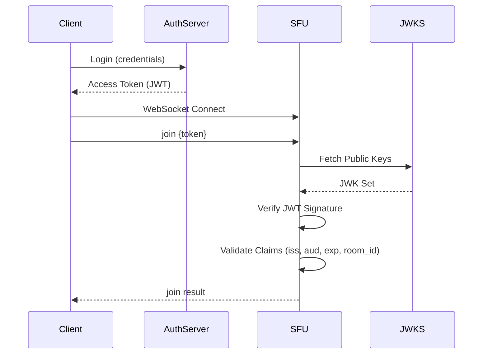

### 6.2 JWT構造

```json
{
  "header": {
    "alg": "RS256",
    "typ": "JWT",
    "kid": "key-id-123"
  },
  "payload": {
    "sub": "user-456",
    "iat": 1705200000,
    "exp": 1705203600,
    "iss": "https://auth.example.com",
    "aud": "sfu.example.com",
    "room_id": "room-789",
    "role": "publisher",
    "permissions": ["publish", "subscribe"],
    "metadata": {
      "display_name": "John Doe"
    }
  }
}
```

### 6.3 権限マトリクス

| 操作           | admin | moderator | publisher | subscriber |
| -------------- | ----- | --------- | --------- | ---------- |
| ルーム作成     | ○     | ×         | ×         | ×          |
| ルーム削除     | ○     | ×         | ×         | ×          |
| 参加者キック   | ○     | ○         | ×         | ×          |
| 参加者ミュート | ○     | ○         | ×         | ×          |
| メディア配信   | ○     | ○         | ○         | ×          |
| メディア受信   | ○     | ○         | ○         | ○          |
| 録画開始/停止  | ○     | ×         | ×         | ×          |

### 6.4 JWT失効管理

短TTL（1時間）+ Redisブラックリストによるハイブリッド方式を採用。

```go
// TokenBlacklist manages revoked JWT tokens
type TokenBlacklist interface {
    // Revoke adds a token to the blacklist
    Revoke(ctx context.Context, tokenID string, expiresAt time.Time) error

    // IsRevoked checks if a token is revoked
    IsRevoked(ctx context.Context, tokenID string) (bool, error)

    // Cleanup removes expired entries (called periodically)
    Cleanup(ctx context.Context) error
}
```

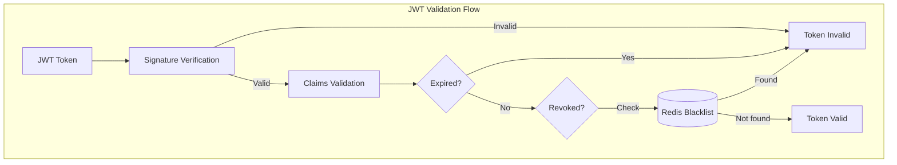

**失効管理パラメータ:**

| パラメータ         | 値                  | 説明                             |
| ------------------ | ------------------- | -------------------------------- |
| トークンTTL        | 1時間               | アクセストークンの有効期限       |
| ブラックリストTTL  | トークンexp + 1時間 | ブラックリストエントリの保持期間 |
| クリーンアップ間隔 | 10分                | 期限切れエントリの削除間隔       |

### 6.5 キーローテーション

```go
// JWKSManager manages JWKS key rotation
type JWKSManager interface {
    // GetPublicKey retrieves the public key by key ID
    GetPublicKey(ctx context.Context, kid string) (*rsa.PublicKey, error)

    // RefreshKeys forces a refresh of the JWKS cache
    RefreshKeys(ctx context.Context) error
}
```

| パラメータ         | 値       | 説明                         |
| ------------------ | -------- | ---------------------------- |
| キーローテーション | 90日ごと | 新キーの生成間隔             |
| 旧キー猶予期間     | 7日      | 旧キーの有効期間（移行期間） |
| JWKSキャッシュTTL  | 1時間    | JWKSのキャッシュ有効期間     |

### 6.6 TURN資格情報管理

```go
// TURNCredentialService generates time-limited TURN credentials
type TURNCredentialService interface {
    // GenerateCredentials creates new TURN credentials for a participant
    GenerateCredentials(ctx context.Context, participantID string) (*TURNCredentials, error)

    // RefreshCredentials generates new credentials before expiry
    RefreshCredentials(ctx context.Context, participantID string) (*TURNCredentials, error)
}

type TURNCredentials struct {
    URLs       []string
    Username   string
    Credential string
    ExpiresAt  time.Time
}
```

| パラメータ       | 値                               | 説明                 |
| ---------------- | -------------------------------- | -------------------- |
| 資格情報有効期限 | 24時間                           | TURN認証の有効期間   |
| 資格情報更新間隔 | 12時間                           | 自動更新のタイミング |
| 認証方式         | Long-term credentials (RFC 5389) | TURN認証プロトコル   |

### 6.7 レート制限設計

```go
// RateLimiter implements rate limiting for various operations
type RateLimiter interface {
    // Allow checks if the operation is allowed
    Allow(ctx context.Context, key string, limit RateLimit) (bool, error)

    // GetRemaining returns remaining quota
    GetRemaining(ctx context.Context, key string, limit RateLimit) (int, error)
}

type RateLimit struct {
    Requests int           // Number of requests
    Window   time.Duration // Time window
}
```

| 対象                   | 制限              | キー          |
| ---------------------- | ----------------- | ------------- |
| WebSocket接続          | 10回/秒/IP        | IP address    |
| シグナリングメッセージ | 100回/秒/接続     | Connection ID |
| REST API               | 100回/分/トークン | JWT sub claim |
| ルーム作成             | 10回/分/ユーザー  | User ID       |

## 7. 運用設計

### 7.1 デプロイメント構成

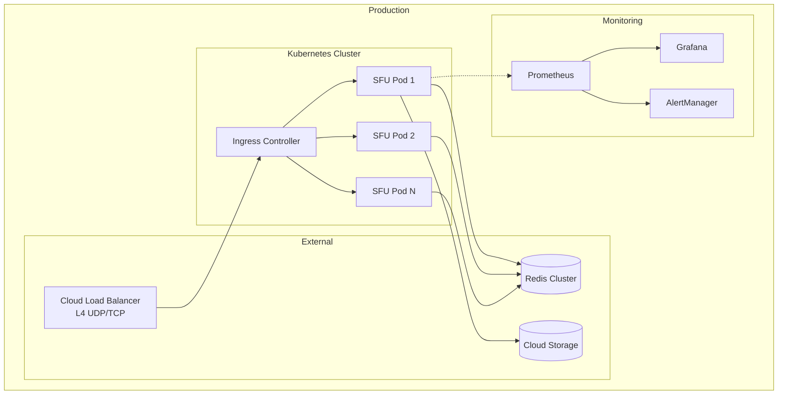

### 7.2 Kubernetes マニフェスト例

```yaml
# sfu-deployment.yaml
apiVersion: apps/v1
kind: Deployment
metadata:
  name: sfu
spec:
  replicas: 3
  selector:
    matchLabels:
      app: sfu
  template:
    metadata:
      labels:
        app: sfu
      annotations:
        prometheus.io/scrape: "true"
        prometheus.io/port: "8080"
        prometheus.io/path: "/metrics"
    spec:
      containers:
        - name: sfu
          image: sfu:latest
          ports:
            - containerPort: 8080
              name: http
            - containerPort: 10000
              name: webrtc-start
              protocol: UDP
          env:
            - name: SFU_PUBLIC_IP
              valueFrom:
                fieldRef:
                  fieldPath: status.hostIP
            - name: REDIS_URL
              valueFrom:
                secretKeyRef:
                  name: sfu-secrets
                  key: redis-url
          resources:
            requests:
              cpu: "1"
              memory: "2Gi"
            limits:
              cpu: "4"
              memory: "8Gi"
          livenessProbe:
            httpGet:
              path: /health
              port: 8080
            initialDelaySeconds: 10
            periodSeconds: 10
          readinessProbe:
            httpGet:
              path: /ready
              port: 8080
            initialDelaySeconds: 5
            periodSeconds: 5
---
apiVersion: v1
kind: Service
metadata:
  name: sfu
spec:
  type: LoadBalancer
  externalTrafficPolicy: Local
  ports:
    - name: http
      port: 80
      targetPort: 8080
    - name: webrtc
      port: 10000
      targetPort: 10000
      protocol: UDP
  selector:
    app: sfu
```

### 7.3 メトリクス定義

要件定義書に基づく全メトリクス（Prometheus形式）:

| メトリクス名                 | 型        | 説明                      | ラベル                        |
| ---------------------------- | --------- | ------------------------- | ----------------------------- |
| `sfu_rooms_total`            | Gauge     | アクティブルーム数        | -                             |
| `sfu_connections_total`      | Gauge     | 総接続数                  | -                             |
| `sfu_connections_per_room`   | Histogram | ルームあたり接続数分布    | room_id                       |
| `sfu_bytes_received_total`   | Counter   | 受信バイト数              | room_id, participant_id       |
| `sfu_bytes_sent_total`       | Counter   | 送信バイト数              | room_id, participant_id       |
| `sfu_packets_received_total` | Counter   | 受信パケット数            | room_id, participant_id       |
| `sfu_packets_sent_total`     | Counter   | 送信パケット数            | room_id, participant_id       |
| `sfu_packets_lost_total`     | Counter   | ロストパケット数          | room_id, participant_id       |
| `sfu_rtt_seconds`            | Histogram | RTT分布                   | room_id, participant_id       |
| `sfu_jitter_seconds`         | Histogram | ジッタ分布                | room_id, participant_id       |
| `sfu_bitrate_bps`            | Gauge     | 現在のビットレート        | room_id, participant_id, kind |
| `sfu_simulcast_layer`        | Gauge     | 選択中のSimulcastレイヤー | room_id, subscription_id      |
| `sfu_track_count`            | Gauge     | アクティブトラック数      | room_id, kind                 |
| `sfu_subscription_count`     | Gauge     | アクティブ購読数          | room_id                       |

### 7.4 メトリクスダッシュボード

| パネル             | メトリクス                                                            | アラート閾値 |
| ------------------ | --------------------------------------------------------------------- | ------------ |
| アクティブルーム数 | `sfu_rooms_total`                                                     | -            |
| 総接続数           | `sfu_connections_total`                                               | > 10000      |
| ルームあたり接続数 | `sfu_connections_per_room`                                            | > 100        |
| 受信スループット   | `rate(sfu_bytes_received_total[1m])`                                  | > 1Gbps      |
| 送信スループット   | `rate(sfu_bytes_sent_total[1m])`                                      | > 1Gbps      |
| パケットロス率     | `rate(sfu_packets_lost_total[1m]) / rate(sfu_packets_sent_total[1m])` | > 5%         |
| RTT P95            | `histogram_quantile(0.95, sfu_rtt_seconds)`                           | > 300ms      |
| ジッタ P95         | `histogram_quantile(0.95, sfu_jitter_seconds)`                        | > 50ms       |
| ビットレート       | `sfu_bitrate_bps`                                                     | -            |
| レイヤー分布       | `count by (sfu_simulcast_layer)`                                      | -            |
| CPU使用率          | `process_cpu_seconds_total`                                           | > 80%        |
| メモリ使用率       | `process_resident_memory_bytes`                                       | > 80%        |

### 7.5 ルーム分散戦略

```go
// RoomCoordinator manages room-to-server assignment
type RoomCoordinator interface {
    // AssignRoom assigns a room to an SFU server using consistent hashing
    AssignRoom(ctx context.Context, roomID string) (serverID string, err error)

    // GetServerForRoom returns the assigned server for a room
    GetServerForRoom(ctx context.Context, roomID string) (serverID string, err error)

    // RebalanceRoom moves a room to a different server (for failover)
    RebalanceRoom(ctx context.Context, roomID string, newServerID string) error
}
```

**Consistent Hashingによるルーム固定:**

- ルームIDをハッシュ化し、サーバーリングにマッピング
- サーバー追加/削除時の再配置を最小化
- 同一ルームは常に同一SFUで処理

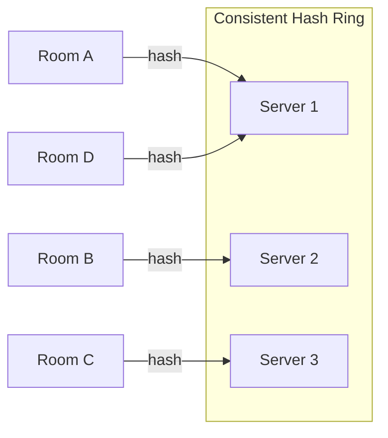

## 8. 付録

### 8.1 エラーコード一覧

| コード | 名称             | 説明                                     | HTTP相当 |
| ------ | ---------------- | ---------------------------------------- | -------- |
| -32700 | Parse error      | JSONパースエラー                         | 400      |
| -32600 | Invalid Request  | 不正なリクエスト形式                     | 400      |
| -32601 | Method not found | 未知のメソッド                           | 404      |
| -32602 | Invalid params   | 不正なパラメータ                         | 400      |
| -32603 | Internal error   | サーバー内部エラー                       | 500      |
| 1001   | Room not found   | ルームが存在しない                       | 404      |
| 1002   | Room full        | ルームが満員                             | 403      |
| 1003   | Unauthorized     | 認証エラー                               | 401      |
| 1004   | Already joined   | 既にルームに参加済み                     | 409      |
| 1005   | Not in room      | ルームに参加していない                   | 403      |
| 1006   | Track not found  | トラックが存在しない                     | 404      |
| 1007   | Invalid SDP      | 不正なSDP                                | 400      |
| 1008   | ICE failure      | ICE接続失敗                              | 503      |
| 1009   | Session expired  | セッション期限切れ（再接続タイムアウト） | 401      |

### 8.2 用語集

| 用語       | 説明                                                                     |
| ---------- | ------------------------------------------------------------------------ |
| SFU        | Selective Forwarding Unit - メディアストリームを選択的に転送するサーバー |
| Publisher  | メディアストリームを送信するクライアント                                 |
| Subscriber | メディアストリームを受信するクライアント                                 |
| Room       | 複数の参加者が接続する論理的な空間                                       |
| Track      | 単一の映像または音声ストリーム                                           |
| SSRC       | Synchronization Source - RTPストリームの識別子                           |
| MID        | Media ID - SDPにおけるメディア記述の識別子                               |
| RID        | Restriction ID - Simulcastレイヤーの識別子                               |
| Simulcast  | 同一ソースを複数の解像度/ビットレートで同時配信する技術                  |
| SVC        | Scalable Video Coding - 単一ストリームで複数品質を実現する技術           |
| TWCC       | Transport-Wide Congestion Control - 輻輳制御メカニズム                   |
| REMB       | Receiver Estimated Maximum Bitrate - 帯域幅推定                          |
| ICE        | Interactive Connectivity Establishment - NAT越え技術                     |
| STUN       | Session Traversal Utilities for NAT - NAT越え支援サーバー                |
| TURN       | Traversal Using Relays around NAT - リレーサーバー                       |
