# WebRTC SFU 図表集

本ドキュメントはWebRTC SFUシステムの各種図表（状態遷移図、シーケンス図、アーキテクチャ図）を集約したものである。

> **注記**: 本ドキュメントのアーキテクチャ図はGCP/Cloudflareを使用した具体的なデプロイ構成を示している。
> 詳細なデプロイ手順については[deployment.md](deployment.md)を参照。

## 目次

1. [アーキテクチャ図](#1-アーキテクチャ図)
2. [状態遷移図](#2-状態遷移図)
3. [シーケンス図](#3-シーケンス図)
4. [データフロー図](#4-データフロー図)

---

## 1. アーキテクチャ図

### 1.1 システム全体構成

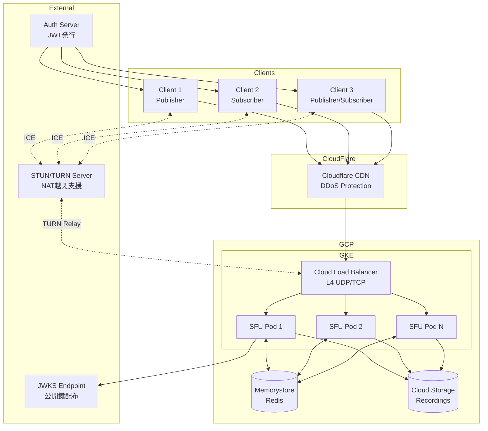

### 1.2 SFUコンポーネント構成

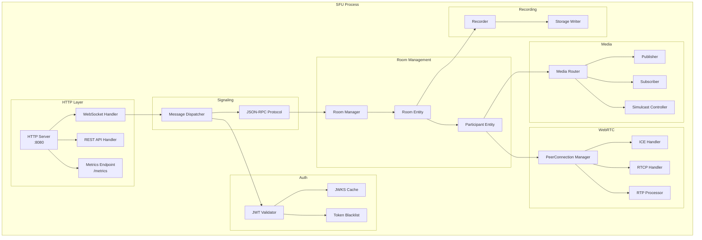

---

## 2. 状態遷移図

### 2.1 ルーム状態遷移

サーバーサイドのルームライフサイクル状態を示す。

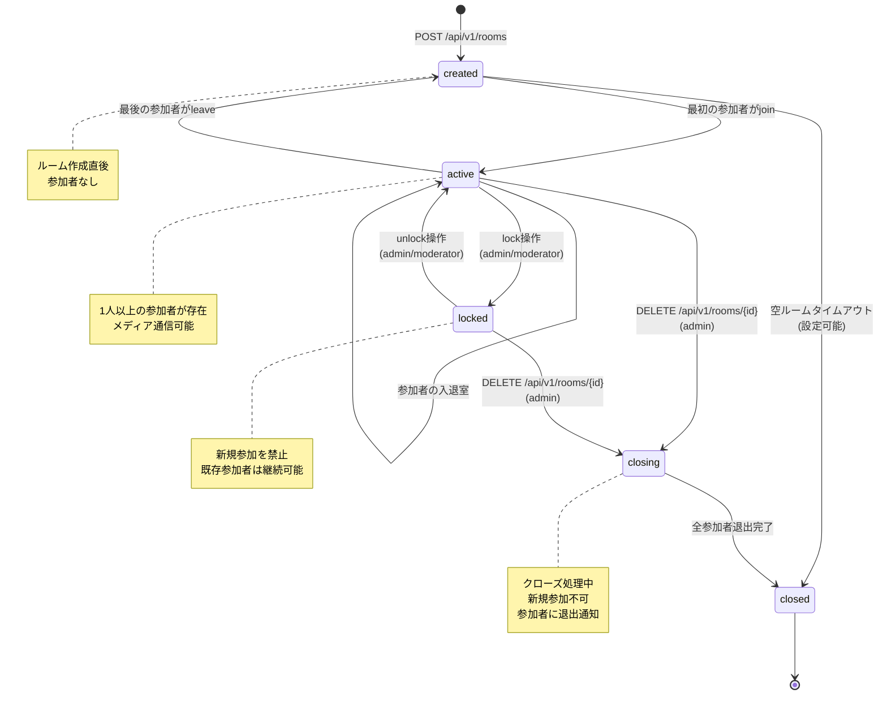

**状態定義:**

| 状態 | 説明 | 許可される操作 |
|------|------|---------------|
| created | ルーム作成直後、参加者なし | join, delete |
| active | 1人以上の参加者が存在 | join, leave, publish, subscribe, lock, delete |
| locked | 新規参加を禁止 | leave, publish, subscribe, unlock, delete |
| closing | クローズ処理中 | leave |
| closed | ルーム終了 | なし |

### 2.2 参加者状態遷移

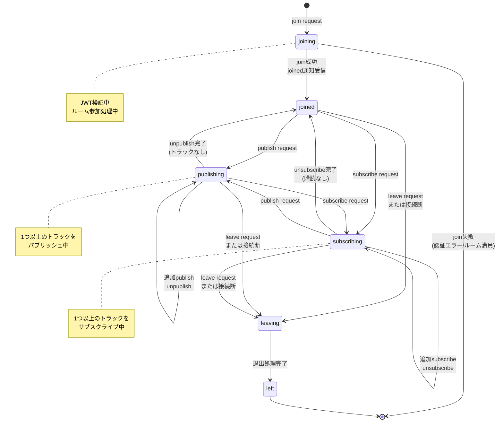

**状態定義:**

| 状態 | 説明 | 許可される操作 |
|------|------|---------------|
| joining | 参加処理中 | - |
| joined | 参加完了、メディア操作なし | publish, subscribe, leave |
| publishing | 1つ以上のトラックをパブリッシュ中 | publish, unpublish, subscribe, unsubscribe, leave |
| subscribing | 1つ以上のトラックをサブスクライブ中 | publish, unpublish, subscribe, unsubscribe, leave |
| leaving | 退出処理中 | - |
| left | 退出完了 | - |

### 2.3 クライアント接続状態遷移

クライアントSDKの接続状態を示す。

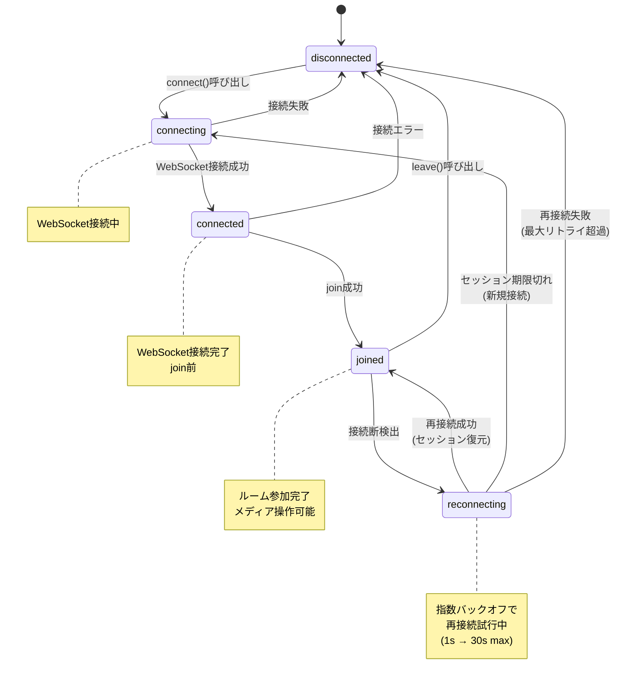

### 2.4 WebRTC接続状態遷移

PeerConnectionの状態遷移を示す。

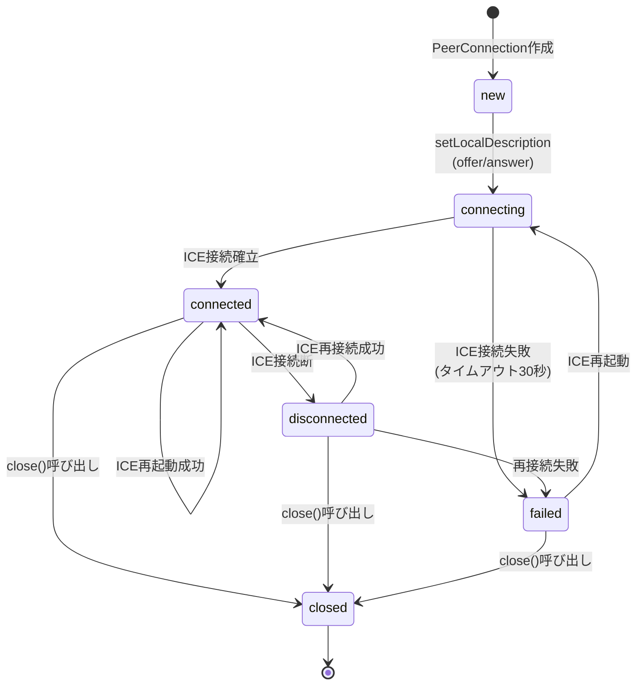

### 2.5 録画状態遷移

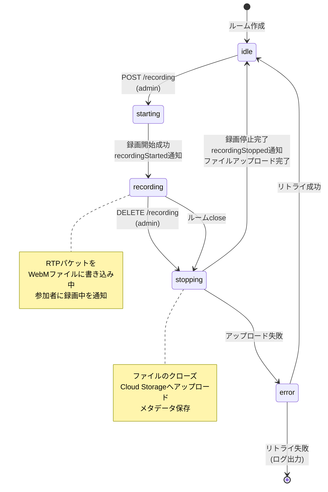

### 2.6 Simulcastレイヤー選択状態

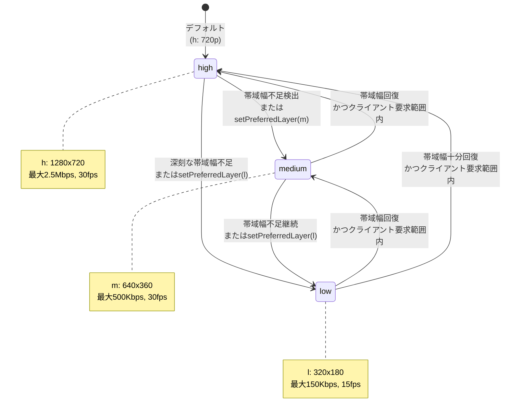

**レイヤー切り替え条件:**

| 切り替え | トリガー条件 |
|---------|-------------|
| 高→中 | パケットロス率 > 5% または RTT > 300ms |
| 中→低 | パケットロス率 > 10% または 帯域幅 < 400Kbps |
| 低→中 | パケットロス率 < 1% かつ 帯域幅 > 600Kbps |
| 中→高 | パケットロス率 < 1% かつ 帯域幅 > 2Mbps |

---

## 3. シーケンス図

### 3.1 認証フロー

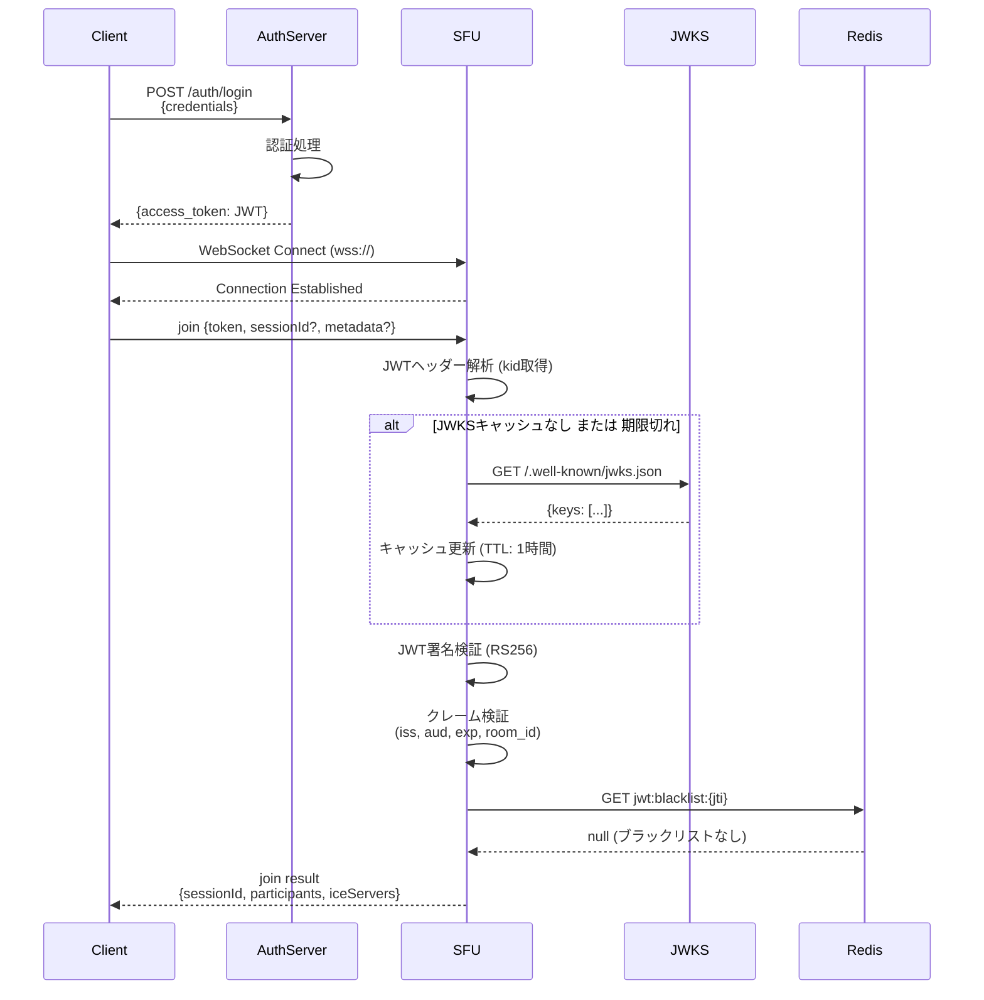

### 3.2 参加フロー

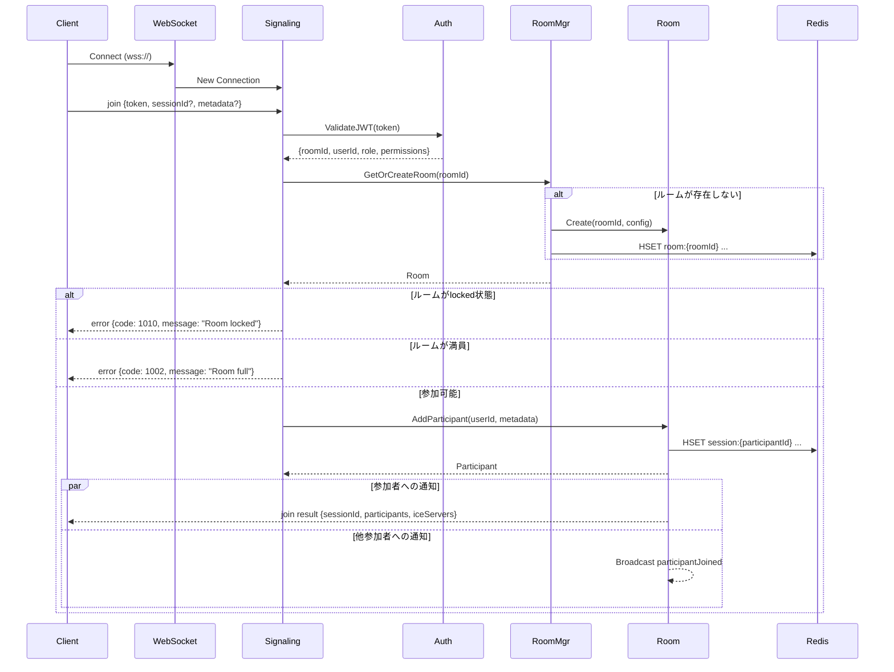

### 3.3 パブリッシュフロー

```mermaid
sequenceDiagram
    participant Client
    participant Signaling
    participant Participant
    participant MediaRouter
    participant Room

    Client->>Signaling: publish {kind: "video", simulcast: true, metadata?}
    Signaling->>Signaling: 権限チェック (role: publisher以上)
    Signaling->>Participant: Publish(kind, opts)
    Participant->>Participant: トラック数チェック<br/>(映像3, 音声2/参加者)
    Participant->>MediaRouter: AddTrack(track)
    MediaRouter-->>Participant: trackId
    Participant-->>Signaling: LocalTrack
    Signaling-->>Client: publish result {trackId, mid}

    Note over Client,Signaling: SDP Negotiation (Client-initiated)

    Client->>Client: createOffer()
    Client->>Signaling: offer {sdp}
    Signaling->>Participant: SetRemoteDescription(offer)
    Participant->>Participant: CreateAnswer()
    Signaling-->>Client: offer result {sdp: answer}

    loop ICE Candidates
        Client->>Signaling: candidate {candidate, sdpMid, sdpMLineIndex}
        Signaling->>Participant: AddICECandidate(candidate)
        Signaling-->>Client: candidate result {}
    end

    Note over Client,Room: メディア接続確立後

    Room->>Room: Broadcast trackPublished
    Room-->>Client: trackPublished (to other participants)
```

### 3.4 サブスクライブフロー

```mermaid
sequenceDiagram
    participant Client
    participant Signaling
    participant Participant
    participant MediaRouter
    participant Publisher

    Client->>Signaling: subscribe {publisherId, trackId, preferredLayer?}
    Signaling->>Signaling: 権限チェック (role: subscriber以上)
    Signaling->>Participant: Subscribe(publisherId, trackId, layer)
    Participant->>MediaRouter: Subscribe(trackId)
    MediaRouter->>Publisher: GetTrack(trackId)
    Publisher-->>MediaRouter: RemoteTrack
    MediaRouter->>Participant: AddRemoteTrack(track)

    Note over Participant,Client: Server-initiated SDP Offer

    Participant->>Participant: CreateOffer()
    Signaling-->>Client: offer notification {sdp, reason: "track_added"}
    Client->>Client: setRemoteDescription(offer)
    Client->>Client: createAnswer()
    Client->>Signaling: answer {sdp}
    Signaling->>Participant: SetRemoteDescription(answer)

    loop ICE Candidates (Server → Client)
        Signaling-->>Client: candidate notification {candidate}
        Client->>Client: addIceCandidate(candidate)
    end

    Signaling-->>Client: subscribe result {subscriptionId}

    Note over Client: メディア受信開始
```

### 3.5 再接続フロー

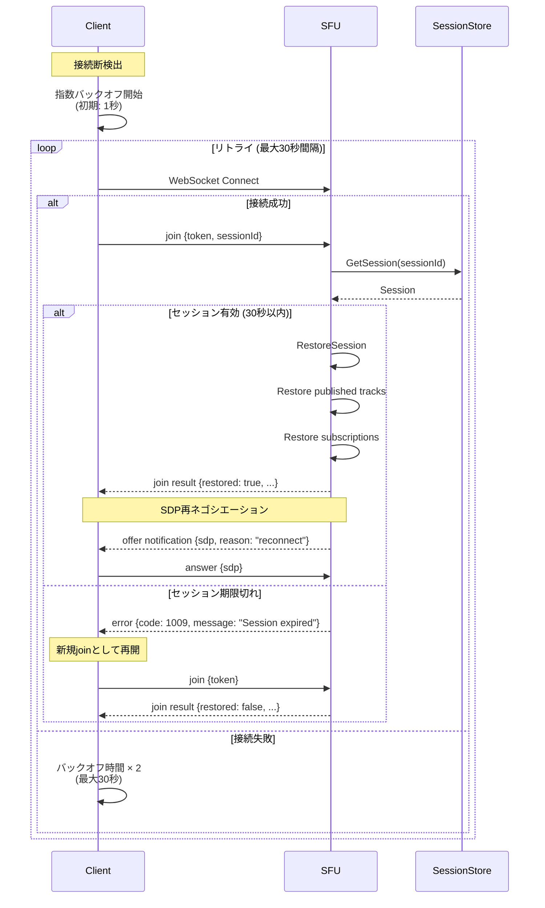

### 3.6 録画フロー

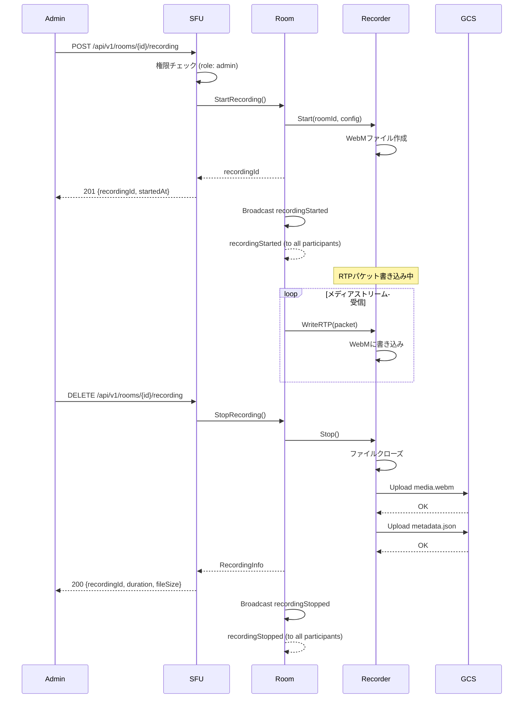

---

## 4. データフロー図

### 4.1 メディアデータフロー

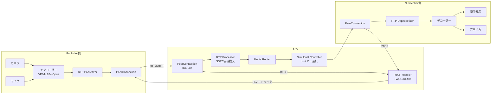

### 4.2 シグナリングデータフロー

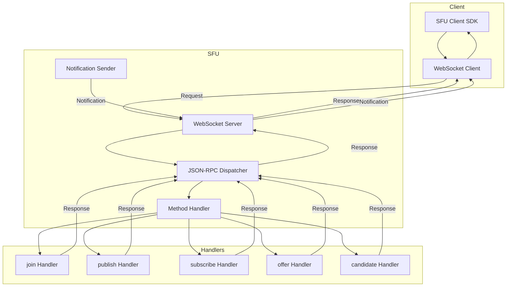

---

## 関連ドキュメント

- [requirements.md](requirements.md) - 要件定義書
- [design.md](design.md) - 設計書
- [api/openapi.yaml](api/openapi.yaml) - REST API仕様
- [api/jsonrpc-schema.json](api/jsonrpc-schema.json) - シグナリングプロトコル仕様
- [sdk-spec.md](sdk-spec.md) - クライアントSDK仕様
- [adr/](adr/) - アーキテクチャ決定記録
